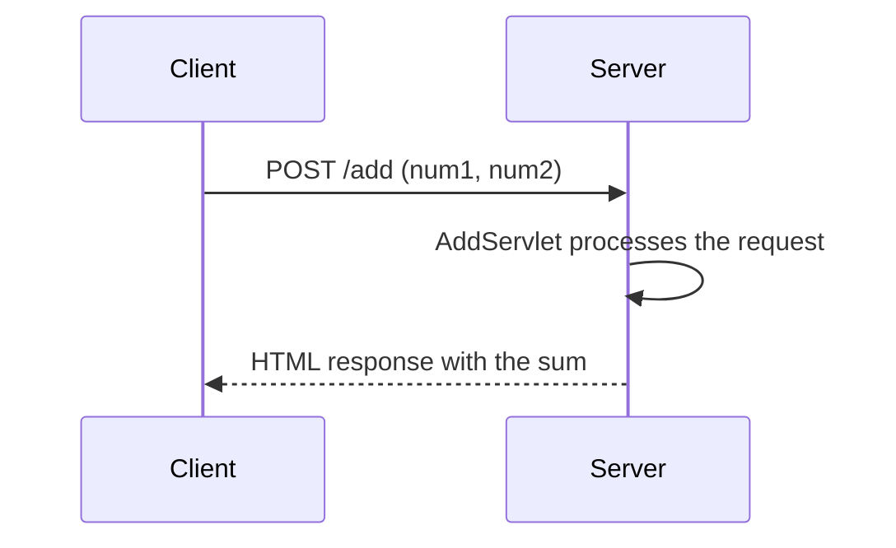
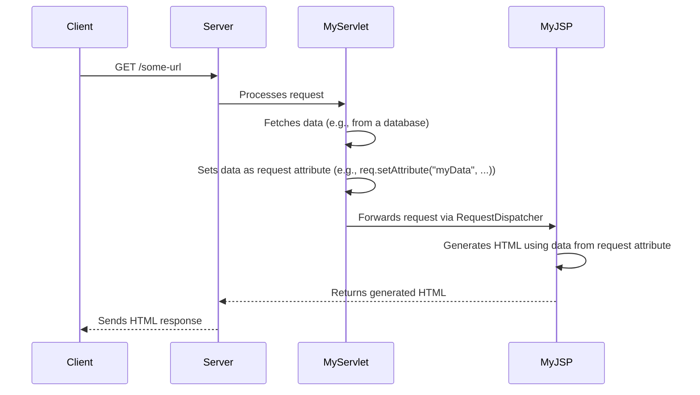
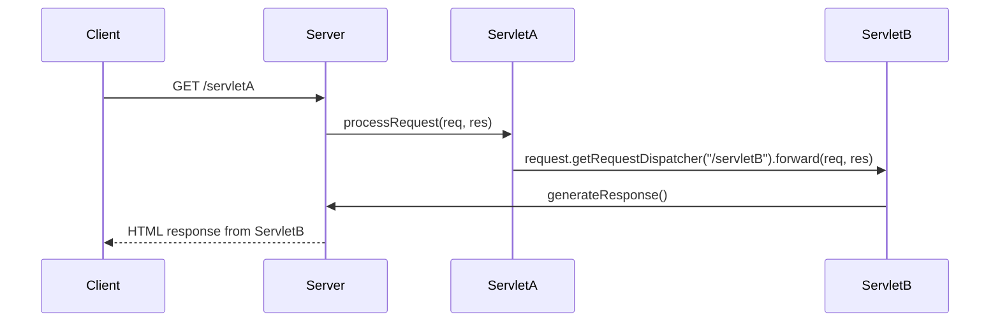
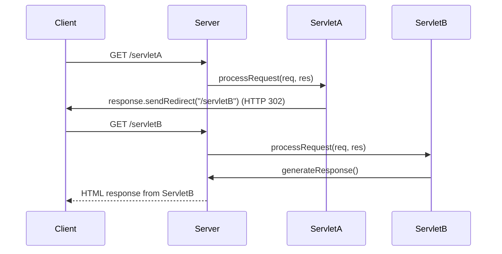
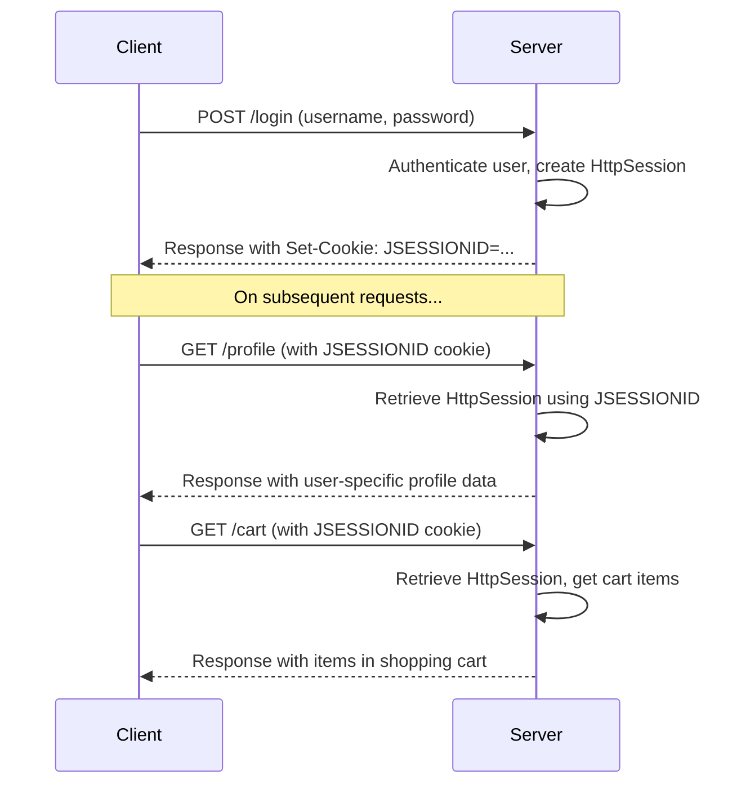
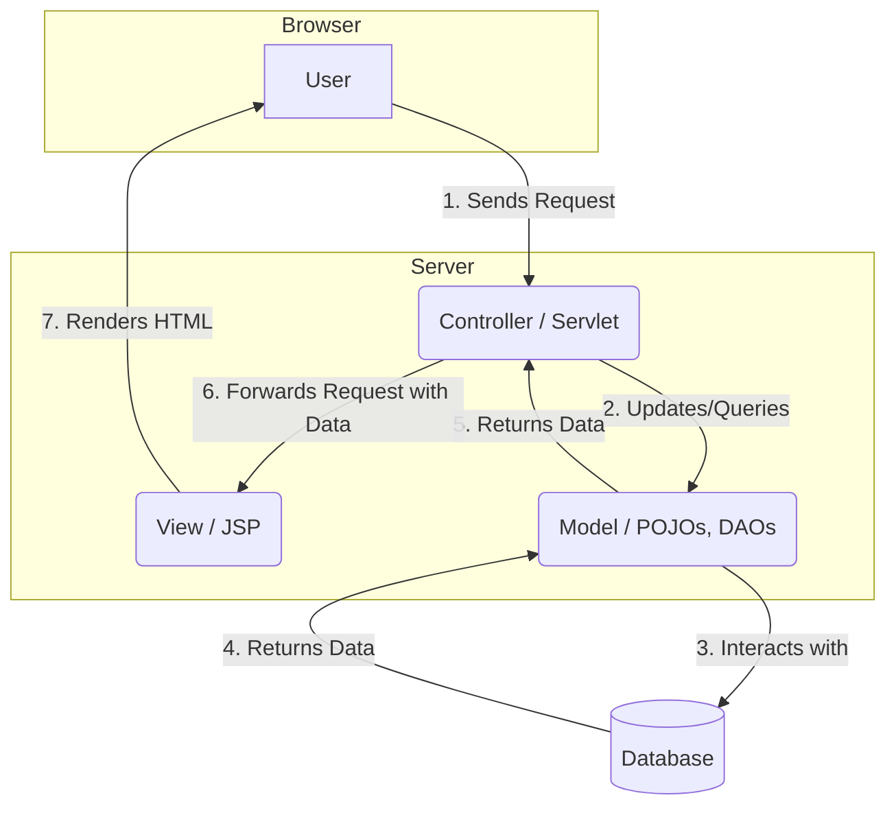
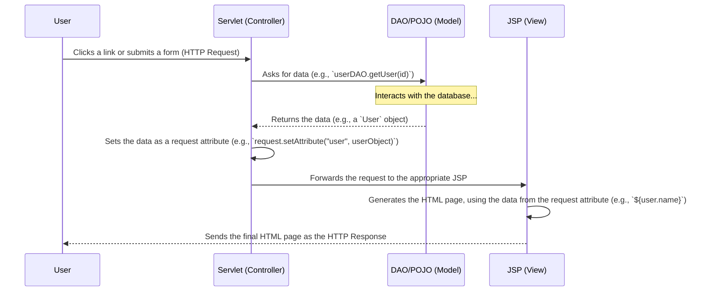
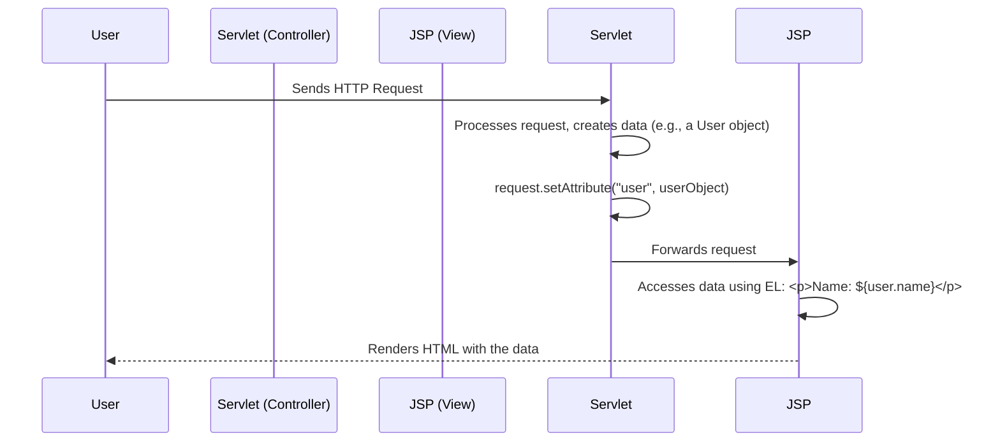
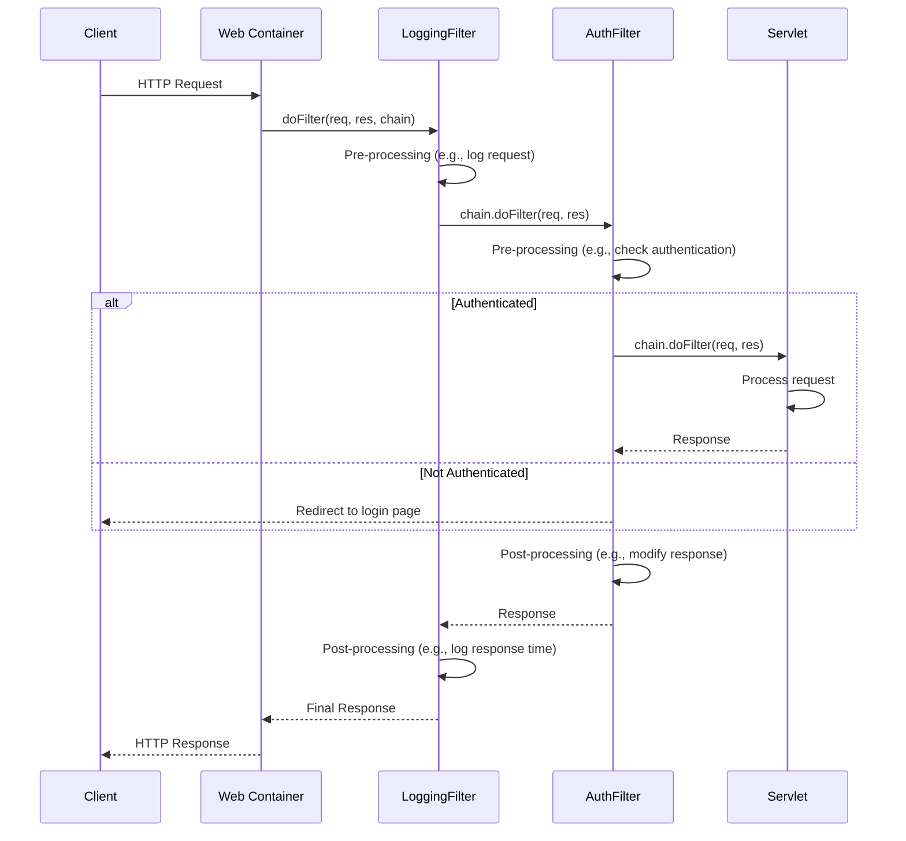
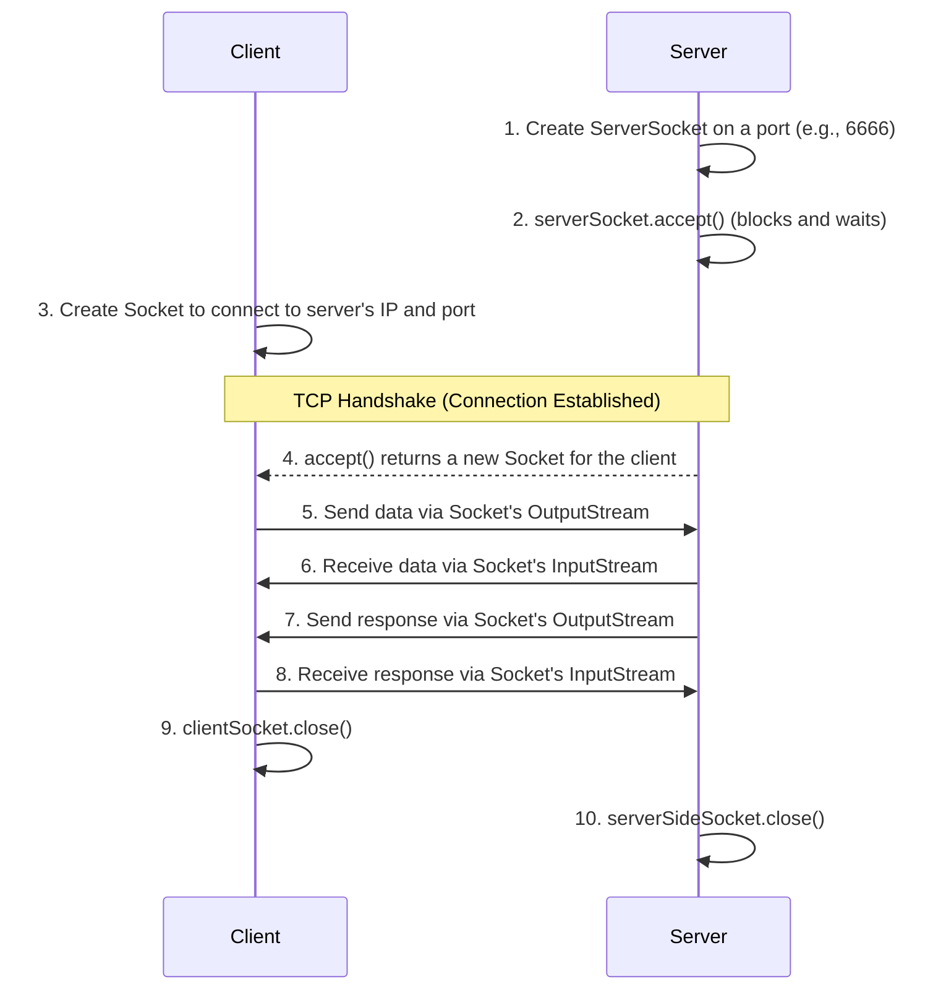

# WebStore Application

This is a simple web application that demonstrates a basic client-server interaction.

## Add Two Numbers

The application has a page that allows users to add two numbers. The user enters two numbers in a form, and the server returns the sum.

### How it Works

Here is a diagram that shows how information flows between the client (the user's browser) and the server:



## Servlets and JSPs: The Controller and the View

In Java web applications, **Servlets** and **JavaServer Pages (JSPs)** are the core components for handling web requests and generating dynamic content. They work together, often in a Model-View-Controller (MVC) pattern, to separate application logic from presentation.

*   **Servlet**: A Java class that processes requests and generates responses. It's the "controller" in MVC. It handles business logic, interacts with databases, and prepares data.
*   **JSP**: A text document that contains HTML (or XML) markup and special JSP elements. It's the "view" in MVC. Its main job is to present the data prepared by the servlet. Behind the scenes, the web container automatically compiles a JSP file into a servlet.

### How They Work Together

The most common pattern is for a servlet to receive a request, process it, and then forward the request to a JSP to render the final HTML page.

1.  The client's browser sends a request to a URL that is mapped to a servlet.
2.  The servlet executes, performs some logic (e.g., retrieves data from a database), and stores the result in a request attribute.
3.  The servlet then uses a `RequestDispatcher` to forward the request (along with the data) to a JSP file.
4.  The JSP file uses JSP tags (e.g., Expression Language `${}`) to access the data from the request and dynamically generate the HTML.
5.  The final HTML is sent back to the client's browser.

This separation keeps the Java logic out of the presentation page, making the application easier to manage and maintain.



## `RequestDispatcher` vs. `sendRedirect`

In Java web applications, you can use either `RequestDispatcher` or `sendRedirect` to pass control from one servlet to another. However, they work in fundamentally different ways.

### `RequestDispatcher`

A `RequestDispatcher` performs a server-side forward. The entire process happens within the server, and the client's browser is unaware that a forward has occurred.

**Characteristics:**

*   The URL in the browser does not change.
*   The original request and response objects are passed to the new resource.
*   It is faster than `sendRedirect` because it does not require a new request from the client.

**Diagram:**



### `sendRedirect`

The `sendRedirect` method sends a response to the client that tells it to make a new request to a different URL.

**Characteristics:**

*   The URL in the browser changes to the new URL.
*   The original request and response objects are lost.
*   It is slower than `RequestDispatcher` because it requires a new round trip between the client and the server.

**Diagram:**


## `HttpSession`: Managing User State

`HttpSession` is fundamentally different from `RequestDispatcher` and `sendRedirect`. While the latter two are used for controlling the flow of a *single* request, `HttpSession` is used to manage a user's state *across multiple* requests.

HTTP is a stateless protocol, meaning each request is independent. `HttpSession` provides a mechanism to remember a specific user from one request to the next. When a session is created, the server generates a unique session ID and sends it to the client, usually in a cookie (`JSESSIONID`). The client then sends this cookie back with every subsequent request, allowing the server to identify the user and retrieve their session data.

**Key Differences:**

*   **Purpose:** `RequestDispatcher`/`sendRedirect` are for **navigation and flow control**. `HttpSession` is for **state management and user tracking**.
*   **Scope:** `RequestDispatcher` operates within a single request. `sendRedirect` ends one request and starts another. `HttpSession` persists across multiple requests from the same user.

### How `HttpSession` Works



### Real-World Use Cases

*   **`RequestDispatcher`**:
    *   **MVC (Model-View-Controller) Pattern**: A controller servlet processes a request, fetches data (the model), and then forwards the request (along with the data as request attributes) to a JSP (the view) to render the final HTML page. The user only ever sees the controller's URL.

*   **`sendRedirect`**:
    *   **Post-Redirect-Get (PRG) Pattern**: After a user submits a form (e.g., creating a blog post via POST), the server processes the request and then redirects the client to a new URL (e.g., the page for the newly created post). This prevents the user from accidentally resubmitting the form by refreshing the page.
    *   **Login/Logout**: After a successful login, you redirect the user to their dashboard. After logout, you redirect them to the home page.

*   **`HttpSession`**:
    *   **User Authentication**: Storing a "logged-in" status for a user so they don't have to enter their password for every single page they visit.
    *   **Shopping Carts**: Keeping track of the items a user has added to their shopping cart as they browse an e-commerce site.
    *   **User Preferences**: Remembering a user's preferences, like language or theme, for the duration of their visit.

## `ServletConfig` and `ServletContext`: Application and Servlet-Level Configuration

Both `ServletConfig` and `ServletContext` are used to provide initialization parameters to your servlets, but they operate at different scopes.

### `ServletContext`

The `ServletContext` object is created by the web container when the web application is deployed. There is **only one `ServletContext` object per web application**, and it is shared among all servlets in that application. It acts as a global, application-wide space for configuration and shared resources.

**Characteristics:**

*   **Scope:** Application-wide. Shared by all servlets.
*   **Lifecycle:** Created when the application starts and destroyed when the application shuts down.
*   **Use Cases:** Storing database connection information, application-wide settings (like an application name or version), or creating shared resources like thread pools.

### `ServletConfig`

The `ServletConfig` object is created by the web container for **each individual servlet**. Each servlet has its own unique `ServletConfig` object.

**Characteristics:**

*   **Scope:** Servlet-specific. Each servlet gets its own.
*   **Lifecycle:** Created when the servlet is first loaded and destroyed when the servlet is unloaded.
*   **Use Cases:** Providing specific initialization parameters to a single servlet, such as a file path for an upload servlet or a specific API endpoint for a data-retrieval servlet.

### Diagram: Scope Visualization

This diagram shows that the `ServletContext` is for the entire application, while each servlet has its own `ServletConfig`.

```mermaid
graph TD
    subgraph Web Container (e.g., Tomcat)
        subgraph Web Application (ServletContext)
            direction LR
            ServletA --- ConfigA[ServletConfig for A]
            ServletB --- ConfigB[ServletConfig for B]
            ServletC --- ConfigC[ServletConfig for C]
        end
    end

    ServletContext -- contains --> ServletA
    ServletContext -- contains --> ServletB
    ServletContext -- contains --> ServletC
```

### How to Apply Them: Code Example

You can define context and config parameters in your `web.xml` file.

**1. Configure in `web.xml`**

```xml
<?xml version="1.0" encoding="UTF-8"?>
<web-app ...>

    <!-- This is available to ALL servlets -->
    <context-param>
        <param-name>appName</param-name>
        <param-value>My Awesome WebStore</param-value>
    </context-param>

    <servlet>
        <servlet-name>ConfigDemoServlet</servlet-name>
        <servlet-class>com.example.servlets.ConfigDemoServlet</servlet-class>
        <!-- This is available ONLY to ConfigDemoServlet -->
        <init-param>
            <param-name>servletVersion</param-name>
            <param-value>1.2</param-value>
        </init-param>
    </servlet>
    <servlet-mapping>
        <servlet-name>ConfigDemoServlet</servlet-name>
        <url-pattern>/config-demo</url-pattern>
    </servlet-mapping>

</web-app>
```

**2. Access in a Servlet**

Here is how you would access these parameters in a servlet.

```java
package com.example.servlets;

import java.io.IOException;
import java.io.PrintWriter;
import javax.servlet.ServletConfig;
import javax.servlet.ServletContext;
import javax.servlet.ServletException;
import javax.servlet.http.HttpServlet;
import javax.servlet.http.HttpServletRequest;
import javax.servlet.http.HttpServletResponse;

// No @WebServlet annotation is needed if configured in web.xml

public class ConfigDemoServlet extends HttpServlet {
    private static final long serialVersionUID = 1L;
    private String appName;
    private String servletVersion;

    @Override
    public void init(ServletConfig config) throws ServletException {
        super.init(config); // Important!

        // Get ServletContext from the config object
        ServletContext context = config.getServletContext();

        // Get application-wide parameter
        this.appName = context.getInitParameter("appName");

        // Get servlet-specific parameter
        this.servletVersion = config.getInitParameter("servletVersion");
    }

    protected void doGet(HttpServletRequest request, HttpServletResponse response) throws ServletException, IOException {
        response.setContentType("text/html");
        PrintWriter out = response.getWriter();

        out.println("<html><body>");
        out.println("<h1>ServletConfig and ServletContext Demo</h1>");
        out.println("<p>Application Name (from ServletContext): " + appName + "</p>");
        out.println("<p>Servlet Version (from ServletConfig): " + servletVersion + "</p>");
        out.println("</body></html>");
    }
}
```

## JSP Tags: Scriptlets, Expressions, and Declarations

JSPs use special tags to embed Java code directly into the HTML. While modern development favors JSTL (JSP Standard Tag Library) and Expression Language (EL) to minimize Java code in JSPs, it's important to understand the basic tags.

### 1. Declaration Tag (`<%! ... %>`)

The declaration tag is used to declare variables and methods that become member variables and methods of the generated servlet class.

*   **Syntax**: `<%! declaration; [ declaration; ] ... %>`
*   **Use Case**: Declaring variables or methods that need to be shared across multiple requests for the same JSP page.

### 2. Scriptlet Tag (`<% ... %>`)

The scriptlet tag is used to embed arbitrary Java code into the `_jspService()` method of the generated servlet. This is where you can place your business logic, loops, or conditional statements.

*   **Syntax**: `<% code fragment %>`
*   **Use Case**: Executing Java code for each request.

### 3. Expression Tag (`<%= ... %>`)

The expression tag is used to evaluate a Java expression and print the result directly into the HTML output. The expression is evaluated, converted to a `String`, and inserted into the page.

*   **Syntax**: `<%= expression %>`
*   **Use Case**: Displaying the value of a variable or the result of a method call.

### Code Example

Here is a JSP file that demonstrates all three tags.

```jsp
<%@ page language="java" contentType="text/html; charset=UTF-8"
    pageEncoding="UTF-8"%>
<!DOCTYPE html>
<html>
<head>
<meta charset="UTF-8">
<title>JSP Tags Demo</title>
</head>
<body>

    <h1>JSP Tags: Scriptlets, Expressions, and Declarations</h1>

    <%-- Declaration Tag: Declares a variable and a method --%>
    <%!
        private int counter = 0;

        public String getGreeting(String name) {
            return "Hello, " + name + "!";
        }
    %>

    <%-- Scriptlet Tag: Increments the counter and defines a local variable --%>
    <%
        counter++;
        String userName = "Guest";
    %>

    <p>
        This page has been visited
        <%-- Expression Tag: Prints the value of the counter --%>
        <strong><%= counter %></strong>
        time(s).
    </p>

    <p>
        <%-- Expression Tag: Calls the declared method --%>
        <strong><%= getGreeting(userName) %></strong>
    </p>

</body>
</html>
```

## JSP Directives (Declarative Tags)

JSP directives are messages to the JSP container that provide global information about the entire JSP page. They are "declarative" because they don't produce any direct output but instead configure the properties of the page or include other resources. They are always enclosed in `<%@ ... %>`.

There are three main types of directives:

### 1. `page` Directive

The `page` directive defines page-dependent attributes, such as the scripting language, error pages, and session management. It's typically placed at the top of the JSP file.

*   **Syntax**: `<%@ page attribute="value" %>`
*   **Common Attributes**:
    *   `language`: Specifies the scripting language (e.g., "java").
    *   `contentType`: Sets the content type and character encoding of the response.
    *   `import`: Lists the Java packages to be imported, similar to an `import` statement in a Java class.
    *   `session`: Indicates whether the page participates in an HTTP session.
    *   `errorPage`: Specifies a URL to which the request is forwarded if an uncaught exception occurs.

**Example:**
```jsp
<%@ page language="java" 
         contentType="text/html; charset=UTF-8"
         import="java.util.Date, java.text.SimpleDateFormat"
         session="true"
         errorPage="error.jsp" %>
```

### 2. `include` Directive

The `include` directive includes the content of another file (HTML, JSP, text, etc.) into the current JSP file *during the translation phase*. This means the included file's content is merged with the JSP before it is compiled into a servlet.

*   **Syntax**: `<%@ include file="relativeURL" %>`
*   **Use Case**: Including reusable page fragments like headers, footers, or navigation bars. It's very efficient because the inclusion happens only once when the JSP is compiled.

**Example:**
```jsp
<body>
    <%@ include file="header.jsp" %>
    
    <main>
        <p>This is the main content of the page.</p>
    </main>
    
    <%@ include file="footer.jsp" %>
</body>
```

### 3. `taglib` Directive

The `taglib` directive declares that the page will use a custom tag library. It associates a prefix with a library, allowing you to use the custom tags in your JSP. The most common use is for the JSTL (JSP Standard Tag Library).

*   **Syntax**: `<%@ taglib uri="tagLibraryURI" prefix="tagPrefix" %>`
*   **Use Case**: Using tag libraries like JSTL to avoid scriptlet code and make the JSP cleaner and more maintainable.

**Example (using JSTL Core):**
```jsp
<%@ taglib uri="http://java.sun.com/jsp/jstl/core" prefix="c" %>

<html>
<body>
    <%-- Using a JSTL tag to loop through a collection --%>
    <c:forEach var="item" items="${myListOfItems}">
        <p><c:out value="${item}" /></p>
    </c:forEach>
</body>
</html>
```

## `pageContext`: The "Context" of a JSP Page

The `pageContext` object is a JSP implicit object that provides access to all the JSP scopes and several page attributes. It's a central object that encapsulates the environment of a JSP page.

### Key Features

1.  **Centralized Access Point**: It provides a single point of access to other implicit objects, such as `request`, `response`, `session`, and `application` (`ServletContext`).
2.  **Scoped Attribute Manager**: It allows you to set, get, and remove attributes in any of the four JSP scopes: `page`, `request`, `session`, and `application`.

### Key Methods

*   `setAttribute(String name, Object value, int scope)`: Sets an attribute in the specified scope.
*   `getAttribute(String name, int scope)`: Retrieves an attribute from the specified scope.
*   `removeAttribute(String name, int scope)`: Removes an attribute from the specified scope.
*   `findAttribute(String name)`: Searches for an attribute in all four scopes in the order: `page`, `request`, `session`, and `application`.
*   `getRequest()`, `getResponse()`, `getSession()`, `getServletContext()`: Provide direct access to other implicit objects.

### The Four JSP Scopes

1.  **`PageContext.PAGE_SCOPE`**: Available only within the current JSP page.
2.  **`PageContext.REQUEST_SCOPE`**: Available for the entire HTTP request.
3.  **`PageContext.SESSION_SCOPE`**: Available across multiple requests from the same user.
4.  **`PageContext.APPLICATION_SCOPE`**: Available to all users and servlets in the application.

### Code Example

```jsp
<%@ page language="java" contentType="text/html; charset=UTF-8"
    pageEncoding="UTF-8"%>
<!DOCTYPE html>
<html>
<head>
<meta charset="UTF-8">
<title>pageContext Demo</title>
</head>
<body>

    <h1>pageContext Demo</h1>

    <%
        // Set attributes in all four scopes
        pageContext.setAttribute("pageVar", "I am in the page scope", PageContext.PAGE_SCOPE);
        pageContext.setAttribute("requestVar", "I am in the request scope", PageContext.REQUEST_SCOPE);
        pageContext.setAttribute("sessionVar", "I am in the session scope", PageContext.SESSION_SCOPE);
        pageContext.setAttribute("appVar", "I am in the application scope", PageContext.APPLICATION_SCOPE);
    %>

    <h2>Retrieving Attributes</h2>
    <p><strong>Page Scope:</strong> <%= pageContext.getAttribute("pageVar", PageContext.PAGE_SCOPE) %></p>
    <p><strong>Request Scope:</strong> <%= pageContext.getAttribute("requestVar", PageContext.REQUEST_SCOPE) %></p>
    <p><strong>Session Scope:</strong> <%= pageContext.getAttribute("sessionVar", PageContext.SESSION_SCOPE) %></p>
    <p><strong>Application Scope:</strong> <%= pageContext.getAttribute("appVar", PageContext.APPLICATION_SCOPE) %></p>

    <h2>Using `findAttribute`</h2>
    <p><strong>Found "pageVar":</strong> <%= pageContext.findAttribute("pageVar") %></p>
    <p><strong>Found "sessionVar":</strong> <%= pageContext.findAttribute("sessionVar") %></p>

</body>
</html>
```

## JSP Exception Handling

There are two primary ways to handle exceptions in JSP:

1.  **Declarative Error Pages (Recommended):** Using the `page` directive to specify a dedicated error page. This is the cleanest approach as it separates your main logic from your error handling logic.
2.  **Scriptlet `try-catch` Blocks:** Using standard Java `try-catch` blocks within JSP scriptlets. This is useful for handling specific exceptions where you want to recover or display a message without redirecting the user.

### 1. Declarative Error Pages (`errorPage` Directive)

This is the standard, preferred method. You configure a JSP to automatically forward to a specific error page whenever an uncaught exception occurs.

**Step 1: Create the page that might cause an error.**

In this JSP, you use the `errorPage` attribute of the `page` directive to point to the JSP that will handle the error.

**`index.jsp`**
```jsp
<%@ page language="java" contentType="text/html; charset=UTF-8"
    pageEncoding="UTF-8" errorPage="error.jsp" %>
<!DOCTYPE html>
<html>
<head>
<title>Exception Handling Demo</title>
</head>
<body>
    <h1>Demonstrating JSP Exception Handling</h1>
    <%
        // This will cause an ArithmeticException
        int result = 10 / 0;
        out.println("This line will never be reached.");
    %>
</body>
</html>
```

**Step 2: Create the dedicated error page.**

This page must use the `isErrorPage="true"` attribute in its `page` directive. This gives the page access to the implicit `exception` object, which contains details about the error that occurred.

**`error.jsp`**
```jsp
<%@ page language="java" contentType="text/html; charset=UTF-8"
    pageEncoding="UTF-8" isErrorPage="true" %>
<!DOCTYPE html>
<html>
<head>
<title>Error</title>
<style>
    body { font-family: sans-serif; }
    .error-box { border: 1px solid #cc0000; background-color: #ffeeee; padding: 15px; margin: 20px; }
    pre { background-color: #f0f0f0; padding: 10px; border: 1px solid #ccc; }
</style>
</head>
<body>
    <div class="error-box">
        <h2>Oops! An error occurred.</h2>
        <p>We are sorry, but our application has encountered a problem.</p>
        
        <p>
            <strong>Error Message:</strong> <%= exception.getMessage() %>
        </p>
        
        <p>
            <strong>Exception Type:</strong> <%= exception.getClass().getName() %>
        </p>

        <%-- It's generally not a good idea to show the stack trace to end-users in production,
             but it's very useful during development. --%>
        <h3>Developer Details (Stack Trace):</h3>
        <pre><%
            exception.printStackTrace(new java.io.PrintWriter(out));
        %></pre>
    </div>
</body>
</html>
```

### 2. Scriptlet `try-catch` Blocks

You can also use a standard Java `try-catch` block directly inside a JSP scriptlet. This is useful if you anticipate a specific exception and want to handle it gracefully without redirecting.

**`try-catch-demo.jsp`**
```jsp
<%@ page language="java" contentType="text/html; charset=UTF-8"
    pageEncoding="UTF-8"%>
<!DOCTYPE html>
<html>
<head>
<title>Try-Catch Demo</title>
</head>
<body>
    <h1>Using a try-catch Block in a JSP</h1>

    <%
        try {
            // Attempting a risky operation
            String numberStr = "abc";
            int number = Integer.parseInt(numberStr); // This will throw a NumberFormatException
            out.println("<p>The number is: " + number + "</p>");

        } catch (NumberFormatException e) {
            // Handle the exception gracefully
            out.println("<p style='color: red;'>Error: The provided string is not a valid number.</p>");
        }
    %>

    <p>Execution continues after the try-catch block.</p>

</body>
</html>
```

## JDBC in JSP

Connecting a JSP to a database using JDBC (Java Database Connectivity) involves two main steps: adding the database driver to your project and then writing the Java code in your JSP to handle the connection and queries.

### A Word of Caution: Best Practices (MVC)

While the following example shows how to put database code directly into a JSP file for demonstration purposes, **this is not a good practice for real-world applications**. Mixing database logic (the "Model") with your presentation code (the "View") makes your application hard to maintain, debug, and secure.

The standard and recommended approach is the **Model-View-Controller (MVC)** pattern:
1.  A **Servlet (Controller)** receives the request and calls a Java class to get data from the database.
2.  The data is stored as an attribute in the `request` or `session` scope.
3.  The request is then forwarded to a **JSP (View)**, which is only responsible for displaying the data.

### Step 1: Add the JDBC Driver to Your Project

Before you can connect to a database, your web application needs the appropriate JDBC driver. This is a `.jar` file that contains the necessary Java classes to communicate with your specific database (e.g., MySQL, PostgreSQL).

1.  **Download the Driver**:
    *   For **MySQL**: Download the "MySQL Connector/J" JAR file from the official MySQL website.
    *   For **PostgreSQL**: Download the "PostgreSQL JDBC Driver" JAR from the official PostgreSQL website.
2.  **Add the JAR to your `lib` folder**:
    For a standard Maven web application, place the downloaded `.jar` file into the `/src/main/webapp/WEB-INF/lib/` directory. If this folder doesn't exist, create it. The web container (like Tomcat) will automatically load any JAR files from this directory into the application's classpath.

### Step 2: Create a JSP with JDBC Code

The following JSP file demonstrates the five core steps of JDBC to connect to a database, retrieve a list of users, and display them in an HTML table.

**Key JDBC Steps:**
1.  **Load the Driver**: `Class.forName()` loads the driver class into memory.
2.  **Establish Connection**: `DriverManager.getConnection()` uses the driver to connect to the database URL with your credentials.
3.  **Create Statement**: A `Statement` object is used to send SQL queries to the database.
4.  **Execute Query**: The query is executed, and the results are returned in a `ResultSet` object.
5.  **Process Results**: You iterate through the `ResultSet` to access the data.
6.  **Close Resources**: It is **critical** to close the `Connection`, `Statement`, and `ResultSet` in a `finally` block to prevent resource leaks.

### Code Sample: `database-demo.jsp`

This example assumes you have a database with a `users` table.

```jsp
<%@ page language="java" contentType="text/html; charset=UTF-8" pageEncoding="UTF-8"%>
<%@ page import="java.sql.*" %>
<!DOCTYPE html>
<html>
<head>
<title>JDBC in JSP Demo</title>
<style>
    body { font-family: sans-serif; }
    table { width: 60%; border-collapse: collapse; margin-top: 20px; }
    th, td { border: 1px solid #ddd; padding: 8px; text-align: left; }
    th { background-color: #f2f2f2; }
    .note { background-color: #fffbe6; border-left: 4px solid #ffc107; padding: 10px; margin-bottom: 20px; }
</style>
</head>
<body>
    <h1>Users from Database</h1>

    <div class="note">
        <strong>Note:</strong> This is for demonstration only. In a real application, use a connection pool and keep database logic in a separate Java class (following the MVC pattern). Do not hardcode credentials in a JSP.
    </div>

    <%
        // --- Database Connection Details ---
        // Replace with your actual database details
        String url = "jdbc:mysql://localhost:3306/your_database_name";
        String user = "your_username";
        String password = "your_password";
        String dbDriver = "com.mysql.cj.jdbc.Driver"; // For modern MySQL

        Connection conn = null;
        Statement stmt = null;
        ResultSet rs = null;

        try {
            // 1. Load the JDBC driver
            Class.forName(dbDriver);

            // 2. Establish the connection
            conn = DriverManager.getConnection(url, user, password);

            // 3. Create a statement
            stmt = conn.createStatement();

            // 4. Execute the query
            String sql = "SELECT id, name, email FROM users";
            rs = stmt.executeQuery(sql);

            // 5. Process the result set and display as a table
    %>
            <table>
                <tr>
                    <th>ID</th>
                    <th>Name</th>
                    <th>Email</th>
                </tr>
    <%
            while (rs.next()) {
    %>
                <tr>
                    <td><%= rs.getInt("id") %></td>
                    <td><%= rs.getString("name") %></td>
                    <td><%= rs.getString("email") %></td>
                </tr>
    <%
            }
    %>
            </table>
    <%
        } catch (Exception e) {
            // Handle exceptions (e.g., database connection error, SQL errors)
            out.println("<p style='color: red;'>Error: " + e.getMessage() + "</p>");
            // It's helpful to print the stack trace during development
            e.printStackTrace(new java.io.PrintWriter(out));
        } finally {
            // 6. Close all resources in a finally block to ensure they are always closed
            try {
                if (rs != null) rs.close();
                if (stmt != null) stmt.close();
                if (conn != null) conn.close();
            } catch (SQLException se) {
                // Log this error or handle it appropriately
                se.printStackTrace(new java.io.PrintWriter(out));
            } finally {
                 // 7. Close all resources in a finally block to ensure they are always closed
                 try {
                     if (rs != null) rs.close();
                     if (stmt != null) stmt.close();
                     if (conn != null) conn.close();
                 } catch (SQLException se) {
                     // Log this error or handle it appropriately
                     se.printStackTrace(new java.io.PrintWriter(out));
                 }
            }
        }
    %>
</body>
</html>
```

## The MVC (Model-View-Controller) Architecture

The **Model-View-Controller (MVC)** is a widely adopted software design pattern for implementing user interfaces. Its primary goal is to **separate concerns**, meaning it divides the application's logic into three interconnected components. This separation makes applications more organized, flexible, and easier to maintain.

In the context of a Java web application, the roles are typically filled as follows:
*   **Model**: Plain Old Java Objects (POJOs) and Data Access Objects (DAOs).
*   **View**: JavaServer Pages (JSP) with JSTL.
*   **Controller**: Servlets.

### The Three Components

#### 1. The Model
The **Model** is the heart of the application. It represents the data and the business logic. It is responsible for managing the application's state, including reading and writing data to the database. The Model knows nothing about the user interface; its only job is to manage the data.

*   **Responsibilities**:
    *   Represents the application's data (e.g., a `User` object, a `Product` object).
    *   Contains the business logic (e.g., rules for calculating a price, validating data).
    *   Interacts with the database (e.g., saving, updating, deleting, and retrieving data).

#### 2. The View
The **View** is what the user sees. It is the user interface (UI) of the application, responsible for presenting the data from the Model to the user. The View should be "dumb," meaning it should not contain any business logic. Its only job is to display information.

*   **Responsibilities**:
    *   Renders the user interface (e.g., an HTML page).
    *   Displays the data it receives from the Controller.
    *   Sends user actions (e.g., button clicks, form submissions) to the Controller.

#### 3. The Controller
The **Controller** acts as the intermediary between the Model and the View. It receives user input from the View, processes it (by interacting with the Model), and then decides which View to display next. It is the "traffic cop" of the application.

*   **Responsibilities**:
    *   Handles incoming HTTP requests from the user.
    *   Invokes the Model to perform business logic and retrieve data.
    *   Selects the appropriate View to render the response.
    *   Passes the data from the Model to the View.

### How They Work Together: The Flow

This diagram illustrates the relationship and flow of control between the three components.



### Sequence Diagram: A Typical Web Request

Here is a more detailed look at the sequence of events for a single user request.



### Benefits of Using MVC

*   **Separation of Concerns**: This is the biggest advantage. It allows for a clean separation between the UI (View) and the business logic (Model), making the code easier to understand, test, and maintain.
*   **Parallel Development**: Different developers can work on the Model, View, and Controller components simultaneously without interfering with each other.
*   **Code Reusability**: The same Model can be used by multiple Views, allowing you to create different representations of the same data.
*   **Flexibility and Scalability**: It is much easier to change the user interface without touching the underlying business logic, or to add new features without breaking existing ones.

## Data Access Object (DAO) Pattern

The **Data Access Object (DAO)** is a structural design pattern that provides an abstract interface to some type of database or other persistence mechanism. It's a key part of the **Model** in an MVC architecture. The main purpose of the DAO is to **completely hide the data source implementation details** from its clients (the business logic part of your application).

By using the DAO pattern, you separate the business logic (e.g., a servlet processing a request) from the data access logic (e.g., the messy JDBC or Hibernate code).

### How it Works

The pattern involves creating an interface that defines the standard operations to be performed on a model object. Then, you create a concrete class that implements this interface and contains the actual logic for connecting to the database and performing the operations.

This diagram shows how the DAO pattern fits into the MVC architecture:

```mermaid
graph TD
    subgraph "Controller (Servlet)"
        A[UserServlet]
    end

    subgraph "Model"
        B[UserDAO Interface]
        C[UserDAOImpl (JDBC)]
        D[User (POJO)]
    end

    subgraph "Database"
        E[(MySQL DB)]
    end

    A --> B: Uses
    B -- "implemented by" --> C
    C -- "accesses" --> E
    A -- "works with" --> D
    B -- "works with" --> D
    C -- "works with" --> D
```

### Code Example

Let's illustrate the DAO pattern with a simple `User` example.

#### 1. The Model (POJO)

This is a simple Java object representing the data.

**`User.java`**
```java
package com.example.model;

public class User {
    private int id;
    private String name;
    private String email;

    // Getters and Setters...
}
```

#### 2. The DAO Interface

This interface defines the contract for data operations. The business logic will only ever interact with this interface, not the concrete implementation.

**`UserDao.java`**
```java
package com.example.dao;

import com.example.model.User;
import java.util.List;

public interface UserDao {
    void addUser(User user);
    void updateUser(User user);
    void deleteUser(int userId);
    List<User> getAllUsers();
    User getUserById(int userId);
}
```

#### 3. The DAO Implementation (Concrete Class)

This class provides the actual implementation of the DAO interface using JDBC. All the messy, database-specific code is encapsulated here.

**`UserDaoImpl.java`**
```java
package com.example.dao;

import com.example.model.User;
import java.sql.*;
import java.util.ArrayList;
import java.util.List;

public class UserDaoImpl implements UserDao {

    private String jdbcURL = "jdbc:mysql://localhost:3306/your_db";
    private String jdbcUsername = "your_user";
    private String jdbcPassword = "your_password";

    // Implement all the methods defined in the UserDao interface
    // ... (Example for getAllUsers)

    @Override
    public List<User> getAllUsers() {
        List<User> userList = new ArrayList<>();
        try (Connection connection = DriverManager.getConnection(jdbcURL, jdbcUsername, jdbcPassword);
             PreparedStatement preparedStatement = connection.prepareStatement("SELECT * FROM users");) {
            
            ResultSet rs = preparedStatement.executeQuery();

            while (rs.next()) {
                User user = new User();
                user.setId(rs.getInt("id"));
                user.setName(rs.getString("name"));
                user.setEmail(rs.getString("email"));
                userList.add(user);
            }
        } catch (SQLException e) {
            e.printStackTrace(); // Proper error handling
        }
        return userList;
    }
    
    // ... other method implementations (addUser, updateUser, etc.)
}
```

#### 4. The Controller (Servlet) Using the DAO

Now, the servlet can use the `UserDao` to get data without knowing anything about JDBC or the database.

**`UserServlet.java`**
```java
package com.example.controller;

import com.example.dao.UserDao;
import com.example.dao.UserDaoImpl;
import com.example.model.User;
import java.io.IOException;
import java.util.List;
import javax.servlet.ServletException;
import javax.servlet.http.HttpServlet;
import javax.servlet.http.HttpServletRequest;
import javax.servlet.http.HttpServletResponse;

public class UserServlet extends HttpServlet {
    private UserDao userDao;

    public void init() {
        userDao = new UserDaoImpl(); // In a real app, use dependency injection
    }

    protected void doGet(HttpServletRequest request, HttpServletResponse response)
            throws ServletException, IOException {
        
        List<User> allUsers = userDao.getAllUsers();
        
        request.setAttribute("users", allUsers);
        request.getRequestDispatcher("user-list.jsp").forward(request, response);
    }
}
```

### Benefits of Using the DAO Pattern

*   **Separation of Concerns**: Business logic is cleanly separated from persistence logic.
*   **Easy to Switch Persistence Mechanisms**: If you want to switch from JDBC to Hibernate, you only need to create a new `UserDao` implementation (`UserDaoHibernateImpl`) and change how it's instantiated in the servlet. The rest of your application remains unchanged.
*   **Easier Testing**: You can easily create a mock implementation of the `UserDao` interface (`UserDaoMockImpl`) to test your business logic without needing a real database.
*   **Centralized Data Access**: All data access logic is in one place, making it easier to manage and debug.

## Expression Language (EL): The Modern Way to Access Data in JSP

**Expression Language (EL)** was introduced in JSP 2.0 to provide a cleaner, more elegant way to access data from Java objects and web scopes without using Java code (scriptlets). It simplifies JSPs by replacing bulky `<%= ... %>` tags with a concise `${...}` syntax, promoting a better separation of logic (in servlets) and presentation (in JSPs).

### Why Use EL?

*   **Cleanliness**: It removes Java code from your JSPs, making them easier to read and maintain for web designers who may not be Java developers.
*   **Convenience**: It automatically handles `null` values gracefully (displaying nothing instead of throwing a `NullPointerException`).
*   **Simplified Access**: It provides easy access to JavaBeans, collections, request parameters, and other implicit objects.

### How it Works: The Flow

The typical flow is for a servlet to prepare data and a JSP to use EL to display it.



### Code Example

Let's demonstrate how a servlet can set data and a JSP can display it using EL.

#### 1. The Model (POJO)

A simple JavaBean to hold our data.

**`Student.java`**
```java
package com.example.model;

public class Student {
    private int id;
    private String name;
    private Address address; // Nested object

    // Constructor, Getters, and Setters...
}

// A nested object for demonstration
public class Address {
    private String city;
    private String zipCode;

    // Constructor, Getters, and Setters...
}
```

#### 2. The Controller (Servlet)

This servlet creates a `Student` object, sets it as a request attribute, and forwards to the JSP.

**`ElDemoServlet.java`**
```java
package com.example.servlets;

import com.example.model.Student;
import com.example.model.Address;
import java.io.IOException;
import javax.servlet.ServletException;
import javax.servlet.annotation.WebServlet;
import javax.servlet.http.HttpServlet;
import javax.servlet.http.HttpServletRequest;
import javax.servlet.http.HttpServletResponse;
import javax.servlet.http.HttpSession;

@WebServlet("/el-demo")
public class ElDemoServlet extends HttpServlet {
    protected void doGet(HttpServletRequest request, HttpServletResponse response)
            throws ServletException, IOException {

        // 1. Create a simple data object (Model)
        Address address = new Address("New York", "10001");
        Student student = new Student(1, "John Doe", address);

        // 2. Set the data as an attribute in the request scope
        request.setAttribute("student", student);

        // 3. Set an attribute in the session scope
        HttpSession session = request.getSession();
        session.setAttribute("userRole", "Administrator");

        // 4. Forward the request to the JSP (View)
        request.getRequestDispatcher("el-demo.jsp").forward(request, response);
    }
}
```

#### 3. The View (JSP)

This JSP uses EL to access and display the data set by the servlet.

**`el-demo.jsp`**
```jsp
<%@ page language="java" contentType="text/html; charset=UTF-8"
    pageEncoding="UTF-8"%>
<!DOCTYPE html>
<html>
<head>
<title>EL Demo</title>
</head>
<body>
    <h1>Expression Language Demo</h1>

    <%-- EL automatically calls student.getName() --%>
    <p>Student Name: <strong>${student.name}</strong></p>

    <%-- Accessing a nested object property --%>
    <p>Student City: <strong>${student.address.city}</strong></p>

    <%-- Accessing a session-scoped attribute --%>
    <%-- It's good practice to specify the scope for clarity --%>
    <p>User Role (from session): <strong>${sessionScope.userRole}</strong></p>

    <%-- EL automatically searches scopes (page, request, session, application) --%>
    <p>User Role (auto-searched): <strong>${userRole}</strong></p>

    <%-- EL handles null gracefully. If 'nonExistent' is null, it prints nothing. --%>
    <p>Non-existent attribute: <strong>${nonExistent}</strong></p>

</body>
</html>
```

### Key EL Implicit Objects

EL provides several implicit objects to access web application resources:

*   **`pageScope`**, **`requestScope`**, **`sessionScope`**, **`applicationScope`**: Maps that store attributes for their respective scopes.
*   **`param`**: A map of request parameters (e.g., `${param.username}`).
*   **`paramValues`**: A map that stores multiple values for a single parameter (e.g., from checkboxes).
*   **`header`**: A map of request header names and their values.
*   **`cookie`**: A map of cookie names and their corresponding cookie objects.
*   **`initParam`**: A map of context initialization parameters.
*   **`pageContext`**: The `PageContext` object for the current page.

## JSTL (JSP Standard Tag Library): The Key to Scriptlet-Free JSPs

While Expression Language (EL) is excellent for *accessing* data, **JSTL** is what allows you to *work* with that data using logic like loops and conditionals, all without writing a single line of Java scriptlet code. JSTL is a collection of custom JSP tags that encapsulate core functionality needed in web applications.

The primary goal of using JSTL and EL together is to **completely eliminate Java code from your JSPs**, leading to a clean separation of concerns (MVC).

### How to Add JSTL to Your Project

To use JSTL, you need to add its library (`.jar` file) to your project. The easiest way is with Maven. Add this dependency to your `pom.xml`:

```xml
<dependency>
    <groupId>javax.servlet</groupId>
    <artifactId>jstl</artifactId>
    <version>1.2</version>
</dependency>
```
The web container will then make the JSTL tags available to your application.

### Using JSTL in a JSP: The `taglib` Directive

To use a JSTL library in a JSP, you must declare it at the top of the file with the `taglib` directive. The most common library is the **core** library, which is assigned the conventional prefix `c`.

```jsp
<%@ taglib uri="http://java.sun.com/jsp/jstl/core" prefix="c" %>
```

### Most Common JSTL Core Tags

Here are the essential JSTL core tags you will use in almost every web application.

#### `c:out`
Safely prints a value to the page. It automatically escapes HTML characters (like `<`, `>`, `&`) to prevent Cross-Site Scripting (XSS) attacks.

```jsp
<%-- Instead of ${student.name}, this is safer --%>
<c:out value="${student.name}" />

<%-- You can provide a default value if the primary one is null --%>
<c:out value="${student.nickname}" default="N/A" />
```

#### `c:set`
Sets a variable in a specific JSP scope (page, request, session, or application).

```jsp
<%-- Create a variable named 'isAdmin' and store it in the request scope --%>
<c:set var="isAdmin" value="${sessionScope.user.role == 'ADMIN'}" scope="request" />
```

#### `c:if`
A simple conditional block. The body is executed only if the `test` condition is true.

```jsp
<c:if test="${isAdmin}">
    <p><a href="/admin/dashboard">Admin Dashboard</a></p>
</c:if>

<c:if test="${empty cart.items}">
    <p>Your shopping cart is empty.</p>
</c:if>
```

#### `c:forEach`
The most powerful JSTL tag. It iterates over a collection (like a `List`, `Set`, or `Map`).

```jsp
<table>
    <tr>
        <th>ID</th>
        <th>Name</th>
        <th>Email</th>
    </tr>
    <c:forEach var="user" items="${userList}">
        <tr>
            <td><c:out value="${user.id}" /></td>
            <td><c:out value="${user.name}" /></td>
            <td><c:out value="${user.email}" /></td>
        </tr>
    </c:forEach>
</table>
```

#### `c:choose`, `c:when`, `c:otherwise`
This structure provides a "switch-case" or "if-else-if" block.

```jsp
<c:choose>
    <c:when test="${user.status == 'active'}">
        <p style="color: green;">User is Active</p>
    </c:when>
    <c:when test="${user.status == 'suspended'}">
        <p style="color: orange;">User is Suspended</p>
    </c:when>
    <c:otherwise>
        <p style="color: red;">User is Inactive</p>
    </c:otherwise>
</c:choose>
```

### Full Example: Servlet + JSTL

This example shows how a servlet prepares a list of data and a JSP uses JSTL to display it, following the MVC pattern perfectly.

#### 1. The Servlet (Controller)
This servlet creates a list of `Student` objects and forwards them to the JSP.

**`StudentListServlet.java`**
```java
package com.example.servlets;

import com.example.model.Student; // Assuming a simple Student POJO
import java.io.IOException;
import java.util.ArrayList;
import java.util.List;
import javax.servlet.ServletException;
import javax.servlet.annotation.WebServlet;
import javax.servlet.http.HttpServlet;
import javax.servlet.http.HttpServletRequest;
import javax.servlet.http.HttpServletResponse;

@WebServlet("/student-list")
public class StudentListServlet extends HttpServlet {
    protected void doGet(HttpServletRequest request, HttpServletResponse response)
            throws ServletException, IOException {

        // 1. Get data from a DAO (or create a dummy list for demo)
        List<Student> students = new ArrayList<>();
        students.add(new Student(1, "Alice", "alice@example.com"));
        students.add(new Student(2, "Bob", "bob@example.com"));
        students.add(new Student(3, "Charlie", "charlie@example.com"));

        // 2. Set the data as a request attribute
        request.setAttribute("studentList", students);

        // 3. Forward to the JSP for presentation
        request.getRequestDispatcher("student-list.jsp").forward(request, response);
    }
}
```

#### 2. The JSP (View)
This JSP is completely free of Java code. It uses JSTL's `c:forEach` to render the list in a clean, readable way.

**`student-list.jsp`**
```jsp
<%@ page language="java" contentType="text/html; charset=UTF-8" pageEncoding="UTF-8"%>
<%@ taglib uri="http://java.sun.com/jsp/jstl/core" prefix="c" %>
<!DOCTYPE html>
<html>
<head>
<title>Student List</title>
<style>
    body { font-family: sans-serif; }
    table { width: 80%; border-collapse: collapse; margin: 20px auto; }
    th, td { border: 1px solid #ddd; padding: 8px; }
    th { background-color: #f2f2f2; }
</style>
</head>
<body>

    <h1>Our Students</h1>

    <table>
        <thead>
            <tr>
                <th>ID</th>
                <th>Name</th>
                <th>Email</th>
            </tr>
        </thead>
        <tbody>
            <c:forEach var="student" items="${studentList}">
                <tr>
                    <td><c:out value="${student.id}" /></td>
                    <td><c:out value="${student.name}" /></td>
                    <td><c:out value="${student.email}" /></td>
                </tr>
            </c:forEach>
        </tbody>
    </table>

    <%-- Handle the case where the list is empty --%>
    <c:if test="${empty studentList}">
        <p style="text-align: center;">No students found.</p>
    </c:if>

</body>
</html>
```

## JSTL SQL Tags: Direct Database Access from JSP

JSTL also includes a **SQL tag library** that allows you to interact directly with a database from within a JSP page. This can be useful for very simple applications or for rapid prototyping.

### A Strong Word of Caution: Avoid in Production

While the JSTL SQL tags are easy to use, they are **strongly discouraged for real-world applications** for the same reasons you should avoid JDBC in JSPs:

*   **Violates MVC**: It tightly couples your presentation layer (the View) with your data access layer (the Model), making the application a maintenance nightmare.
*   **Poor Security**: Database credentials and queries are embedded directly in the JSP, making them visible and hard to manage. It increases the risk of SQL injection if not handled carefully.
*   **No Connection Pooling**: The tags open and close a new database connection for every operation, which is extremely inefficient and does not scale.

**Best Practice**: Always use the DAO pattern within a proper MVC architecture. The following information is for educational purposes to understand the full capabilities of JSTL.

### How to Use the SQL Tags

First, you need to declare the SQL tag library in your JSP:

```jsp
<%@ taglib uri="http://java.sun.com/jsp/jstl/sql" prefix="sql" %>
```

You also need the appropriate JDBC driver JAR in your `WEB-INF/lib` folder.

### Core JSTL SQL Tags

#### `sql:setDataSource`
Configures the database connection. You can specify a JNDI data source (recommended for servers like Tomcat) or provide the connection details directly.

```jsp
<%-- Option 1: Using a JNDI DataSource (configured on the server) --%>
<sql:setDataSource var="dbSource" dataSource="jdbc/myAppDB" />

<%-- Option 2: Direct connection (for demonstration only) --%>
<sql:setDataSource var="dbSourceDirect"
    driver="com.mysql.cj.jdbc.Driver"
    url="jdbc:mysql://localhost:3306/your_db"
    user="your_user" password="your_password" />
```

#### `sql:query`
Executes a `SELECT` query and stores the result in a variable.

```jsp
<sql:query dataSource="${dbSourceDirect}" var="users">
    SELECT * FROM users WHERE registration_date > ?
    <sql:param value="${aDateVariable}" />
</sql:query>
```

The result object (here, `users`) contains the data, which you can then iterate over with `c:forEach`.

#### `sql:update`
Executes an `INSERT`, `UPDATE`, or `DELETE` statement.

```jsp
<sql:update dataSource="${dbSourceDirect}" var="updateCount">
    INSERT INTO users (name, email) VALUES (?, ?);
    <sql:param value="${param.userName}" />
    <sql:param value="${param.userEmail}" />
</sql:update>
```

### Full Example: `database-jstl-demo.jsp`

This JSP page demonstrates how to use the SQL tags to query a database and display the results in a table. **Remember, this is for demonstration only.**

```jsp
<%@ page language="java" contentType="text/html; charset=UTF-8" pageEncoding="UTF-8"%>
<%@ taglib uri="http://java.sun.com/jsp/jstl/core" prefix="c" %>
<%@ taglib uri="http://java.sun.com/jsp/jstl/sql" prefix="sql" %>

<!DOCTYPE html>
<html>
<head>
<title>JSTL SQL Tag Demo</title>
<style>
    body { font-family: sans-serif; }
    table { width: 80%; border-collapse: collapse; margin: 20px auto; }
    th, td { border: 1px solid #ddd; padding: 8px; }
    th { background-color: #f2f2f2; }
    .warning { color: #856404; background-color: #fff3cd; border: 1px solid #ffeeba; padding: 15px; margin-bottom: 20px; }
</style>
</head>
<body>

    <h1>JSTL SQL Tag Demo</h1>

    <div class="warning">
        <strong>Warning:</strong> This page uses JSTL SQL tags for direct database access.
        This is for demonstration purposes only and is **not** a recommended practice for production applications.
    </div>

    <%-- Step 1: Set up the data source --%>
    <sql:setDataSource var="myDb"
        driver="com.mysql.cj.jdbc.Driver"
        url="jdbc:mysql://localhost:3306/your_database_name"
        user="your_username" password="your_password" />

    <%-- Step 2: Execute the query --%>
    <sql:query dataSource="${myDb}" var="userResults">
        SELECT id, name, email FROM users;
    </sql:query>

    <%-- Step 3: Display the results using JSTL core tags --%>
    <h2>Users List</h2>
    <table>
        <thead>
            <tr>
                <th>ID</th>
                <th>Name</th>
                <th>Email</th>
            </tr>
        </thead>
        <tbody>
            <c:forEach var="row" items="${userResults.rows}">
                <tr>
                    <td><c:out value="${row.id}" /></td>
                    <td><c:out value="${row.name}" /></td>
                    <td><c:out value="${row.email}" /></td>
                </tr>
            </c:forEach>
        </tbody>
    </table>

</body>
</html>
```

## JSTL Functions Library (`fn`)

The JSTL functions library provides a collection of standard functions for string manipulation and other common tasks. To use these functions, you must include the following `taglib` directive at the top of your JSP file:

```jsp
<%@ taglib uri="http://java.sun.com/jsp/jstl/functions" prefix="fn" %>
```

This associates the functions with the prefix `fn`, which you will use to call them.

### Common JSTL Functions

Here are some of the most commonly used functions from the `fn` library:

| Function                               | Description                                                                 |
| -------------------------------------- | --------------------------------------------------------------------------- |
| `fn:contains(string, substring)`       | Returns `true` if the `string` contains the specified `substring`.            |
| `fn:containsIgnoreCase(string, sub)`   | Same as `fn:contains`, but case-insensitive.                                |
| `fn:startsWith(string, prefix)`        | Returns `true` if the `string` starts with the specified `prefix`.            |
| `fn:endsWith(string, suffix)`          | Returns `true` if the `string` ends with the specified `suffix`.              |
| `fn:length(item)`                      | Returns the length of a string or the number of items in a collection.      |
| `fn:toUpperCase(string)`               | Converts all characters in the `string` to uppercase.                       |
| `fn:toLowerCase(string)`               | Converts all characters in the `string` to lowercase.                       |
| `fn:replace(string, before, after)`    | Replaces all occurrences of the `before` substring with the `after` substring. |
| `fn:substring(string, begin, end)`     | Returns a substring of the `string` from the `begin` index to the `end` index. |
| `fn:substringAfter(string, substring)` | Returns the portion of the `string` that comes after the specified `substring`. |
| `fn:substringBefore(string, substring)`| Returns the portion of the `string` that comes before the specified `substring`.|
| `fn:split(string, separator)`          | Splits a `string` into an array of substrings based on the `separator`.       |
| `fn:join(array, separator)`            | Joins the elements of an `array` into a single string, separated by the `separator`. |
| `fn:trim(string)`                      | Removes leading and trailing whitespace from the `string`.                  |
| `fn:escapeXml(string)`                 | Escapes characters that could be interpreted as XML markup (e.g., `<` becomes `&lt;`). |

### Code Example

Here is a JSP page that demonstrates how to use some of these functions.

**`functions-demo.jsp`**
```jsp
<%@ page language="java" contentType="text/html; charset=UTF-8" pageEncoding="UTF-8"%>
<%@ taglib uri="http://java.sun.com/jsp/jstl/core" prefix="c" %>
<%@ taglib uri="http://java.sun.com/jsp/jstl/functions" prefix="fn" %>

<c:set var="testString" value="  JSTL Functions are very useful!  " />
<c:set var="stringArray" value="${fn:split('java,jsp,servlet', ',')}" />

<!DOCTYPE html>
<html>
<head>
<title>JSTL Functions Demo</title>
<style>
    body { font-family: sans-serif; }
    .container { padding: 20px; }
    li { margin-bottom: 10px; }
</style>
</head>
<body>
    <div class="container">
        <h1>JSTL Functions Demo</h1>
        
        <p><strong>Original String:</strong> "${testString}"</p>
        
        <ul>
            <li><strong>Length:</strong> ${fn:length(testString)}</li>
            <li><strong>Trimmed:</strong> "${fn:trim(testString)}"</li>
            <li><strong>Uppercase:</strong> ${fn:toUpperCase(testString)}</li>
            <li><strong>Contains 'JSTL':</strong> ${fn:contains(testString, 'JSTL')}</li>
            <li><strong>Starts with '  JSTL':</strong> ${fn:startsWith(testString, '  JSTL')}</li>
            <li><strong>Replaced 'very' with 'extremely':</strong> ${fn:replace(testString, 'very', 'extremely')}</li>
        </ul>

        <h2>Array created with fn:split()</h2>
        <p>Joined with ' | ': <strong>${fn:join(stringArray, ' | ')}</strong></p>
        <ul>
            <c:forEach var="item" items="${stringArray}">
                <li>${item}</li>
            </c:forEach>
        </ul>
    </div>
</body>
</html>
```

## Servlet Filters: Intercepting Requests and Responses

A **Servlet Filter** is a Java object that can intercept and process HTTP requests before they reach a servlet and before the response is sent back to the client. Filters are a powerful feature of the Java Servlet specification that allow you to perform "pre-processing" and "post-processing" on any request or response.

Filters are often used for cross-cutting concerns that apply to multiple servlets, such as:

*   **Authentication and Authorization**: Checking if a user is logged in before allowing them to access a protected resource.
*   **Logging and Auditing**: Recording information about incoming requests (e.g., IP address, headers, request time).
*   **Image and Data Compression**: Compressing the response data to reduce bandwidth.
*   **Character Encoding**: Setting the character encoding for every request to prevent issues with special characters.
*   **XSS (Cross-Site Scripting) Protection**: Sanitizing incoming request data to prevent malicious script injection.

### How Filters Work: The Filter Chain

Filters work by creating a "chain" of processing steps. When a request comes in that matches a filter's URL pattern, the web container doesn't send the request directly to the servlet. Instead, it sends it to the first filter in the chain.

The filter can then perform its logic and has a crucial choice:

1.  **Pass the request along**: The filter can call `chain.doFilter(request, response)` to pass the request and response objects to the next filter in the chain (or to the target servlet if it's the last filter).
2.  **Block the request**: The filter can choose *not* to call `chain.doFilter()`, effectively blocking the request from ever reaching the servlet. This is useful for security checks where an unauthenticated user should be redirected to a login page.

This flow allows you to create a pipeline of reusable, modular components that can be applied to different parts of your web application.

### Diagram: Visualizing the Filter Chain

This diagram shows how a request passes through a series of filters before reaching the servlet, and how the response travels back through the same filters in reverse order.



### Code Example: Implementing a Logging Filter

Here is a complete example of how to create, configure, and use a servlet filter.

#### 1. Create the Filter Class

First, create a Java class that implements the `javax.servlet.Filter` interface. This example shows a simple logging filter that records the time it takes for a request to be processed.

**`LoggingFilter.java`**
```java
package com.example.filters;

import java.io.IOException;
import javax.servlet.Filter;
import javax.servlet.FilterChain;
import javax.servlet.FilterConfig;
import javax.servlet.ServletException;
import javax.servlet.ServletRequest;
import javax.servlet.ServletResponse;
import javax.servlet.annotation.WebFilter;
import javax.servlet.http.HttpServletRequest;

// The @WebFilter annotation declares this class as a filter
// The urlPatterns attribute specifies which requests this filter will apply to
@WebFilter("/*") // This filter will apply to all requests
public class LoggingFilter implements Filter {

    @Override
    public void init(FilterConfig filterConfig) throws ServletException {
        // This method is called by the web container to indicate to a filter that it is being placed into service.
        System.out.println("LoggingFilter initialized");
    }

    @Override
    public void doFilter(ServletRequest request, ServletResponse response, FilterChain chain)
            throws IOException, ServletException {
        
        HttpServletRequest httpRequest = (HttpServletRequest) request;
        long startTime = System.currentTimeMillis();

        System.out.println("Request for: " + httpRequest.getRequestURI() + " started at " + startTime);

        // This is the most important part: it passes the request along the filter chain.
        // If you do not call this method, the request will stop here and the servlet will not be executed.
        chain.doFilter(request, response);

        long endTime = System.currentTimeMillis();
        System.out.println("Request for: " + httpRequest.getRequestURI() + " ended. Time taken: " + (endTime - startTime) + "ms");
    }

    @Override
    public void destroy() {
        // This method is called by the web container to indicate to a filter that it is being taken out of service.
        System.out.println("LoggingFilter destroyed");
    }
}
```

#### 2. Configure the Filter in `web.xml` (Alternative to Annotations)

While the `@WebFilter` annotation is the modern way to configure filters, you can also declare them in your `web.xml` deployment descriptor. This can be useful for more complex configurations or for older applications.

If you were to configure the `LoggingFilter` in `web.xml` instead of using the annotation, you would add the following:

```xml
<web-app ...>

    <filter>
        <filter-name>LoggingFilter</filter-name>
        <filter-class>com.example.filters.LoggingFilter</filter-class>
    </filter>

    <filter-mapping>
        <filter-name>LoggingFilter</filter-name>
        <url-pattern>/*</url-pattern> <!-- Apply to all URLs -->
    </filter-mapping>

</web-app>
```

**Note**: You should use either the `@WebFilter` annotation or the `web.xml` configuration, but not both for the same filter.

## JavaBeans: Reusable Data Containers

A **JavaBean** is a special type of Java class that is designed to be a reusable software component. In the context of web applications, JavaBeans are most often used as simple data containers (like a struct or a plain data object) to transfer information between different layers of the application, such as from a servlet (Controller) to a JSP (View).

To be a valid JavaBean, a class must follow a strict set of design conventions:

1.  **Public No-Argument Constructor**: The class must have a public constructor that takes no arguments. This allows tools and frameworks to create an instance of the bean easily.
2.  **Private Properties**: The class's instance variables (properties) should be declared as `private` to encapsulate them.
3.  **Public Getters and Setters**: For each property, there must be public "getter" and "setter" methods. For a property named `productName`, the methods would be `getProductName()` and `setProductName(...)`. This provides controlled access to the properties.
4.  **Serializable**: The class should implement the `java.io.Serializable` interface. This allows the bean's state to be saved and restored, which is important for session management and other persistence mechanisms.

### How JavaBeans Fit in MVC

In a typical MVC flow, a servlet will create and populate a JavaBean with data (the Model) and then place it into a scope (like the request scope). The JSP can then access this bean to display its data.

```mermaid
graph TD
    subgraph Controller (Servlet)
        A[ControllerServlet]
    end

    subgraph Model
        B[ProductBean (JavaBean)]
    end

    subgraph View (JSP)
        C[ProductView.jsp]
    end

    A -- 1. Creates & Populates --> B
    A -- 2. Puts Bean in Request Scope --> C
    C -- 3. Reads Data from Bean --> C
```

### Code Example: A Simple JavaBean

Here is an example of a `Product` class that follows the JavaBean conventions.

**`Product.java`**
```java
package com.example.model;

import java.io.Serializable;

public class Product implements Serializable {

    private static final long serialVersionUID = 1L;

    // 1. Private properties
    private int id;
    private String name;
    private double price;

    // 2. Public no-argument constructor
    public Product() {
    }

    // 3. Public getters and setters for each property
    public int getId() {
        return id;
    }

    public void setId(int id) {
        this.id = id;
    }

    public String getName() {
        return name;
    }

    public void setName(String name) {
        this.name = name;
    }

    public double getPrice() {
        return price;
    }

    public void setPrice(double price) {
        this.price = price;
    }
}
```

### Using JavaBeans in a JSP with `<jsp:useBean>`

JSP has special tags for working with JavaBeans, although modern applications often prefer using Expression Language (EL) `${}` for its simplicity. However, it's important to know these standard actions.

*   **`<jsp:useBean>`**: Declares and instantiates a bean.
*   **`<jsp:setProperty>`**: Sets a property on the bean.
*   **`<jsp:getProperty>`**: Gets a property from the bean and prints it.

**`product-bean-demo.jsp`**
```jsp
<%@ page language="java" contentType="text/html; charset=UTF-8" pageEncoding="UTF-8"%>

<%--
    1. <jsp:useBean>
    - id: The variable name for the bean.
    - class: The fully qualified class name of the bean.
    - scope: Where the bean is stored (page, request, session, application). Default is page.
    This tag first looks for an existing bean with the same id and scope. If it doesn't find one, it creates a new instance.
--%>
<jsp:useBean id="product" class="com.example.model.Product" scope="page" />

<%--
    2. <jsp:setProperty>
    - name: The id of the bean to modify.
    - property: The name of the property to set (must match a setter method).
    - value: The value to set the property to.
--%>
<jsp:setProperty name="product" property="id" value="101" />
<jsp:setProperty name="product" property="name" value="Laptop" />
<jsp:setProperty name="product" property="price" value="1250.75" />

<%--
    A powerful feature is to populate a bean from request parameters automatically.
    If the property name matches a request parameter name, it will be set.
    <jsp:setProperty name="product" property="*" />
--%>

<!DOCTYPE html>
<html>
<head>
<title>JavaBean Demo</title>
</head>
<body>
    <h1>Product Details</h1>

    <p>
        <%--
            3. <jsp:getProperty>
            - name: The id of the bean to read from.
            - property: The name of the property to get (must match a getter method).
        --%>
        Product ID: <jsp:getProperty name="product" property="id" /><br/>
        Product Name: <jsp:getProperty name="product" property="name" /><br/>
        Product Price: <jsp:getProperty name="product" property="price" />
    </p>

    <h2>Accessing with Expression Language (Modern Approach)</h2>
    <p>
        Product ID: ${product.id}<br/>
        Product Name: ${product.name}<br/>
        Product Price: ${product.price}
    </p>

</body>
</html>
```

## SOAP vs. REST: Two Approaches to Web Services

**SOAP (Simple Object Access Protocol)** and **REST (REpresentational State Transfer)** are two different approaches for building APIs (Application Programming Interfaces) that allow applications to communicate with each other over a network.

### SOAP

SOAP is a **protocol** with a very strict and well-defined set of standards. It relies exclusively on XML for its message format and can operate over various transport protocols, not just HTTP. It has its own standards for security, transactions, and other enterprise-level features.

*   **Structure**: A SOAP message is an XML document with a specific structure: an `<Envelope>` that wraps a `<Header>` (optional) and a `<Body>` (mandatory).
*   **Operations**: The operations a service provides are formally described in a **WSDL (Web Services Description Language)** file.

### REST

REST is an **architectural style**, not a protocol. It's a set of design principles for building scalable and stateless web services. It leverages the existing, well-understood standards of HTTP.

*   **Resources**: REST is centered around the concept of resources (e.g., a user, a product), which are identified by URIs (e.g., `/api/users/123`).
*   **HTTP Verbs**: It uses standard HTTP methods to perform actions on these resources:
    *   `GET`: Retrieve a resource.
    *   `POST`: Create a new resource.
    *   `PUT`: Update an existing resource.
    *   `DELETE`: Remove a resource.
*   **Data Formats**: REST is flexible and can use various data formats, but **JSON (JavaScript Object Notation)** is the most popular due to its simplicity and lightweight nature.

### Comparison Table

| Feature           | SOAP                                                      | REST                                                                     |
| ----------------- | --------------------------------------------------------- | ------------------------------------------------------------------------ |
| **Stands For**    | Simple Object Access Protocol                             | REpresentational State Transfer                                          |
| **Type**          | Protocol (a strict standard)                              | Architectural Style (a set of flexible guidelines)                       |
| **Data Format**   | Exclusively XML                                           | JSON, XML, HTML, Plain Text, etc. (JSON is most common)                  |
| **Transport**     | Can use any transport protocol (HTTP, SMTP, TCP, etc.)    | Almost always uses HTTP/HTTPS                                            |
| **Standardization** | Highly standardized (WSDL for service description, XSD for schema, WS-Security for security) | Relies on HTTP standards. No single official standard for description (OpenAPI/Swagger is a popular choice). |
| **Security**      | Has its own comprehensive security standard (WS-Security) | Relies on the transport layer for security (HTTPS)                       |
| **Statefulness**  | Can be designed to be stateful                            | Must be stateless; every request must contain all necessary information  |
| **Performance**   | More verbose due to the XML envelope structure, generally slower | Less verbose (especially with JSON), generally faster and more lightweight |
| **Use Cases**     | Enterprise applications, financial services, payment gateways where high security and reliability are required. | Public-facing APIs, mobile applications, and microservices where performance and scalability are key. |

### Diagrams: Visualizing the Communication

#### SOAP Communication Flow

This diagram shows a client making a request to a SOAP service. The request and response are both XML documents wrapped in a SOAP envelope.

```mermaid
sequenceDiagram
    participant Client
    participant Server

    Client->>Server: POST /UserService (SOAP Request)
    Note right of Client: 
      <Envelope>\n  <Header>...</Header>\n  <Body>\n    <GetUser>\n      <UserID>123</UserID>\n    </GetUser>\n  </Body>\n</Envelope>

    Server-->>Client: HTTP 200 OK (SOAP Response)
    Note left of Server:
      <Envelope>\n  <Body>\n    <GetUserResponse>\n      <Name>John Doe</Name>\n      <Email>john.doe@example.com</Email>\n    </GetUserResponse>\n  </Body>\n</Envelope>

```

#### REST Communication Flow

This diagram shows a client making a request to a RESTful API. The client uses a standard HTTP verb and a URI to identify the resource, and the server returns a lightweight JSON representation of that resource.

```mermaid
sequenceDiagram
    participant Client
    participant Server

    Client->>Server: GET /api/users/123
    Note right of Client: Standard HTTP Request

    Server-->>Client: HTTP 200 OK (JSON Response)
    Note left of Server:
        {
          "id": 123,
          "name": "John Doe",
          "email": "john.doe@example.com"
        }

### Implementing a SOAP Web Service in Java (JAX-WS)

Creating a SOAP web service in Java is standardized through the **Java API for XML Web Services (JAX-WS)**. The following example demonstrates how to build and publish a simple "Hello World" style web service.

This approach is often called "Contract-Last" because you start with the Java code, and the WSDL contract is generated from it.

#### Step 1: The Service Endpoint Interface (SEI)

This is a Java interface that declares the methods your web service will offer. It defines the "contract" from a Java perspective.

*   `@WebService`: Marks this interface as defining a web service.
*   `@WebMethod`: Exposes a specific method as a web service operation.

**`HelloWorld.java`**
```java
package com.example.soap;

import javax.jws.WebMethod;
import javax.jws.WebService;
import javax.jws.soap.SOAPBinding;
import javax.jws.soap.SOAPBinding.Style;

// Service Endpoint Interface
@WebService
@SOAPBinding(style = Style.RPC) // RPC style is simpler for this demo
public interface HelloWorld {

    @WebMethod
    String getHelloWorldAsString(String name);
}
```


### When is SOAP Useful?

While REST has become more popular for public-facing and mobile APIs, SOAP remains a strong choice in specific enterprise scenarios due to its robust features and strict standards.

#### 1. High-Security Requirements
SOAP has its own comprehensive security standard called **WS-Security (Web Services Security)**. This standard provides enterprise-grade security features that are built into the protocol itself, not just layered on top.

*   **Use Case**: Financial services, payment gateways, and other applications that handle sensitive data often choose SOAP because WS-Security can enforce message-level security, including encryption and digital signatures for parts of the message itself.

#### 2. Transactional Reliability
SOAP has standards like **WS-AtomicTransaction** that ensure a set of operations are all completed successfully or none of them are (an "all or nothing" principle). This is crucial for maintaining data integrity in distributed systems.

*   **Use Case**: A banking application where a fund transfer involves two separate operations (debiting one account and crediting another). SOAP can wrap these two operations in a single transaction, ensuring that the money is never lost if one of the operations fails.

#### 3. Asynchronous Communication and Stateful Operations
SOAP is not tied to HTTP and can be used over various protocols, including messaging queues like JMS or AMQP. This, combined with standards like **WS-ReliableMessaging**, allows for complex, long-running, and stateful interactions where the client and server need to maintain a conversation over time.

*   **Use Case**: A multi-step booking process for a travel agency, where a user's session and choices need to be reliably maintained across several requests.

#### 4. Formal Contract is a Necessity
The **WSDL (Web Services Description Language)** provides a strict, machine-readable contract that describes exactly what the service can do, what data types it uses, and how to call it. In large, distributed enterprise environments, this formal contract is invaluable for ensuring that different systems can integrate without ambiguity.

*   **Use Case**: Integrating legacy systems within a large corporation where different teams, possibly using different programming languages (e.g., Java, .NET, COBOL), need to communicate. The WSDL acts as a universal translator and a source of truth for the integration.

## `HttpURLConnection`: Java's Built-in HTTP Client

`HttpURLConnection` is a built-in Java class that provides a simple way to make HTTP requests and handle responses. It's part of the core `java.net` package, so it doesn't require any external libraries. While more modern libraries like Apache HttpClient or OkHttp offer more features and a more fluent API, `HttpURLConnection` is perfect for basic HTTP communication.

### How it Works

The process of using `HttpURLConnection` involves these general steps:

1.  Create a `URL` object for the target endpoint.
2.  Open a connection from the `URL` object, which returns an `HttpURLConnection` instance.
3.  Set the request method (e.g., `GET`, `POST`).
4.  Set any necessary request headers (e.g., `Content-Type`, `Authorization`).
5.  If sending a request body (for `POST` or `PUT`), get the connection's `OutputStream` and write the data to it.
6.  Get the response code to check if the request was successful.
7.  Read the response data from the connection's `InputStream`.
8.  Close the connection.

### Code Example: Making GET and POST Requests

This example shows how to use `HttpURLConnection` to perform the two most common HTTP requests.

**`HttpUrlConnectionExample.java`**

```java
package com.example.http;

import java.io.BufferedReader;
import java.io.InputStreamReader;
import java.io.OutputStream;
import java.net.HttpURLConnection;
import java.net.URL;

public class HttpUrlConnectionExample {

    public static void main(String[] args) throws Exception {
        // Demonstrate a GET request
        System.out.println("--- Sending GET request ---");
        sendGet();

        System.out.println("\n--- Sending POST request ---");
        sendPost();
    }

    private static void sendGet() throws Exception {
        URL url = new URL("https://api.github.com/users/google");
        HttpURLConnection con = (HttpURLConnection) url.openConnection();
        con.setRequestMethod("GET");

        // Set request headers
        con.setRequestProperty("User-Agent", "Java-HttpUrlConnection-Client");

        int responseCode = con.getResponseCode();
        System.out.println("GET Response Code :: " + responseCode);

        if (responseCode == HttpURLConnection.HTTP_OK) { // success
            BufferedReader in = new BufferedReader(new InputStreamReader(con.getInputStream()));
            String inputLine;
            StringBuffer response = new StringBuffer();

            while ((inputLine = in.readLine()) != null) {
                response.append(inputLine);
            }
            in.close();

            // print result
            System.out.println(response.toString());
        } else {
            System.out.println("GET request not worked");
        }
    }

    private static void sendPost() throws Exception {
        URL url = new URL("https://jsonplaceholder.typicode.com/posts");
        HttpURLConnection con = (HttpURLConnection) url.openConnection();
        con.setRequestMethod("POST");

        // Set request headers
        con.setRequestProperty("Content-Type", "application/json; utf-8");
        con.setRequestProperty("Accept", "application/json");
        con.setDoOutput(true);

        // The JSON payload to send
        String jsonInputString = "{\"title\": \"foo\", \"body\": \"bar\", \"userId\": 1}";

        try(OutputStream os = con.getOutputStream()) {
            byte[] input = jsonInputString.getBytes("utf-8");
            os.write(input, 0, input.length);
        }

        int responseCode = con.getResponseCode();
        System.out.println("POST Response Code :: " + responseCode);

        if (responseCode == HttpURLConnection.HTTP_CREATED) { // success
            BufferedReader in = new BufferedReader(new InputStreamReader(con.getInputStream()));
            String inputLine;
            StringBuffer response = new StringBuffer();

            while ((inputLine = in.readLine()) != null) {
                response.append(inputLine);
            }
            in.close();

            // print result
            System.out.println(response.toString());
        } else {
            System.out.println("POST request not worked");
        }
    }
}
```

### Real-World Use Cases

*   **Consuming REST APIs**: This is the most common use case. Your application might need to fetch data from a third-party service (like a weather API, a stock market API, or a social media API).
*   **Simple Service-to-Service Communication**: In a microservices architecture, one service might need to make a simple, direct call to another service without the overhead of a full-fledged messaging system.
*   **Basic Web Scraping**: You can use `HttpURLConnection` to download the HTML content of web pages for parsing and data extraction.
*   **Health Checks**: A monitoring service could use it to periodically ping an application's health check endpoint to ensure it is running correctly.


## Socket Programming: The Foundation of Network Communication

At a lower level than HTTP, SOAP, or REST is **socket programming**. Sockets are the fundamental building blocks for all network communication. A socket is one endpoint of a two-way communication link between two programs running on the network. In Java, socket programming is done using the classes in the `java.net` package.

### `ServerSocket` and `Socket`: The Two Key Classes

1.  **`ServerSocket` (Server-side)**: This class is used by a server application to listen for incoming connection requests from clients. It binds to a specific port number on the server machine and waits. When a client tries to connect to that port, the `ServerSocket` accepts the connection and creates a new `Socket` object to handle the communication with that specific client.

2.  **`Socket` (Client-side and for communication)**: A `Socket` object represents a single, dedicated communication channel between a client and a server. The client creates a `Socket` to initiate a connection to a server. On the server side, the `ServerSocket` creates a `Socket` for each client that connects.

### How They Work Together

This diagram shows the typical lifecycle of a client-server interaction using sockets.



### Code Example: A Simple Echo Server

This example shows a server that listens for a client connection, reads a message from the client, and echoes it back.

#### The Server

**`EchoServer.java`**
```java
package com.example.socket;

import java.io.BufferedReader;
import java.io.InputStreamReader;
import java.io.PrintWriter;
import java.net.ServerSocket;
import java.net.Socket;

public class EchoServer {
    public static void main(String[] args) {
        try (ServerSocket serverSocket = new ServerSocket(6666)) {
            System.out.println("Server is listening on port 6666...");

            // The accept() method blocks until a client connects
            Socket clientSocket = serverSocket.accept();
            System.out.println("Client connected: " + clientSocket.getInetAddress().getHostAddress());

            // Get streams for reading from and writing to the client
            PrintWriter out = new PrintWriter(clientSocket.getOutputStream(), true);
            BufferedReader in = new BufferedReader(new InputStreamReader(clientSocket.getInputStream()));

            String inputLine;
            while ((inputLine = in.readLine()) != null) {
                System.out.println("Received from client: " + inputLine);
                // Echo the message back to the client
                out.println("Server echoes: " + inputLine);
            }

        } catch (Exception e) {
            e.printStackTrace();
        }
    }
}
```

#### The Client

**`EchoClient.java`**
```java
package com.example.socket;

import java.io.BufferedReader;
import java.io.InputStreamReader;
import java.io.PrintWriter;
import java.net.Socket;

public class EchoClient {
    public static void main(String[] args) {
        try (Socket socket = new Socket("localhost", 6666)) {
            // Get streams for writing to and reading from the server
            PrintWriter out = new PrintWriter(socket.getOutputStream(), true);
            BufferedReader in = new BufferedReader(new InputStreamReader(socket.getInputStream()));
            
            // Stream to read from the console
            BufferedReader stdIn = new BufferedReader(new InputStreamReader(System.in));

            String userInput;
            System.out.println("Enter a message to send to the server (or 'exit' to quit):");
            while ((userInput = stdIn.readLine()) != null) {
                if ("exit".equalsIgnoreCase(userInput)) {
                    break;
                }
                // Send the user's message to the server
                out.println(userInput);
                // Read the server's response and print it
                System.out.println("Server response: " + in.readLine());
            }

        } catch (Exception e) {
            e.printStackTrace();
        }
    }
}
```

### Real-World Use Cases

While you often use higher-level abstractions like HTTP libraries, raw socket programming is essential for:

*   **Custom Protocols**: When you need to design a communication protocol that is not HTTP-based, such as for real-time gaming, financial data streams, or IoT devices.
*   **Chat Applications**: Classic multi-user chat rooms are often built with a central server that manages connections to many clients using sockets.
*   **High-Performance Systems**: For applications where the overhead of HTTP is too high, direct socket communication can be much faster and more efficient.
*   **File Transfer**: Building custom FTP-like clients and servers.

### Implementing a SOAP Web Service in Java (JAX-WS)

Creating a SOAP web service in Java is standardized through the **Java API for XML Web Services (JAX-WS)**. The following example demonstrates how to build and publish a simple "Hello World" style web service.

This approach is often called "Contract-Last" because you start with the Java code, and the WSDL contract is generated from it.

#### Step 1: The Service Endpoint Interface (SEI)

This is a Java interface that declares the methods your web service will offer. It defines the "contract" from a Java perspective.

*   `@WebService`: Marks this interface as defining a web service.
*   `@WebMethod`: Exposes a specific method as a web service operation.

**`HelloWorld.java`**
```java
package com.example.soap;

import javax.jws.WebMethod;
import javax.jws.WebService;
import javax.jws.soap.SOAPBinding;
import javax.jws.soap.SOAPBinding.Style;

// Service Endpoint Interface
@WebService
@SOAPBinding(style = Style.RPC) // RPC style is simpler for this demo
public interface HelloWorld {

    @WebMethod
    String getHelloWorldAsString(String name);
}
```

#### Step 2: The Service Implementation Bean (SIB)

This is the concrete class that implements the logic defined in the SEI.

*   `@WebService(endpointInterface = ...)`: This annotation links the implementation class to the service endpoint interface.

**`HelloWorldImpl.java`**
```java
package com.example.soap;

import javax.jws.WebService;

// Service Implementation Bean
@WebService(endpointInterface = "com.example.soap.HelloWorld")
public class HelloWorldImpl implements HelloWorld {

    @Override
    public String getHelloWorldAsString(String name) {
        return "Hello World, " + name + "!";
    }
}
```

#### Step 3: The Publisher (Endpoint)

This class uses the built-in HTTP server that comes with the JDK to publish your web service, making it accessible to clients. The `Endpoint.publish()` method starts the server and deploys the service at a specific URL.

**`HelloWorldPublisher.java`**
```java
package com.example.soap;

import javax.xml.ws.Endpoint;

// Endpoint Publisher
public class HelloWorldPublisher {

    public static void main(String[] args) {
        // Publish the service at the specified address
        Endpoint.publish("http://localhost:9999/ws/hello", new HelloWorldImpl());
        
        System.out.println("Service is published at http://localhost:9999/ws/hello");
        System.out.println("To view the WSDL, visit: http://localhost:9999/ws/hello?wsdl");
    }
}
```

### When is SOAP Useful?

While REST has become more popular for public-facing and mobile APIs, SOAP remains a strong choice in specific enterprise scenarios due to its robust features and strict standards.

#### 1. High-Security Requirements
SOAP has its own comprehensive security standard called **WS-Security (Web Services Security)**. This standard provides enterprise-grade security features that are built into the protocol itself, not just layered on top.

*   **Use Case**: Financial services, payment gateways, and other applications that handle sensitive data often choose SOAP because WS-Security can enforce message-level security, including encryption and digital signatures for parts of the message itself.

#### 2. Transactional Reliability
SOAP has standards like **WS-AtomicTransaction** that ensure a set of operations are all completed successfully or none of them are (an "all or nothing" principle). This is crucial for maintaining data integrity in distributed systems.

*   **Use Case**: A banking application where a fund transfer involves two separate operations (debiting one account and crediting another). SOAP can wrap these two operations in a single transaction, ensuring that the money is never lost if one of the operations fails.

#### 3. Asynchronous Communication and Stateful Operations
SOAP is not tied to HTTP and can be used over various protocols, including messaging queues like JMS or AMQP. This, combined with standards like **WS-ReliableMessaging**, allows for complex, long-running, and stateful interactions where the client and server need to maintain a conversation over time.

*   **Use Case**: A multi-step booking process for a travel agency, where a user's session and choices need to be reliably maintained across several requests.

#### 4. Formal Contract is a Necessity
The **WSDL (Web Services Description Language)** provides a strict, machine-readable contract that describes exactly what the service can do, what data types it uses, and how to call it. In large, distributed enterprise environments, this formal contract is invaluable for ensuring that different systems can integrate without ambiguity.

*   **Use Case**: Integrating legacy systems within a large corporation where different teams, possibly using different programming languages (e.g., Java, .NET, COBOL), need to communicate. The WSDL acts as a universal translator and a source of truth for the integration.

    public static void main(String[] args) {
        // Publish the service at the specified address
        Endpoint.publish("http://localhost:9999/ws/hello", new HelloWorldImpl());
        
        System.out.println("Service is published at http://localhost:9999/ws/hello");
        System.out.println("To view the WSDL, visit: http://localhost:9999/ws/hello?wsdl");
    }
}
```

### How to Run and Test

1.  **Compile** all three Java files.
2.  **Run** the `HelloWorldPublisher` class. This will start the web service.
3.  **View the WSDL**: Open your web browser and navigate to `http://localhost:9999/ws/hello?wsdl`. You will see the automatically generated WSDL file, which formally describes your service, its methods, and the expected message formats.

### Sample SOAP Messages

When a client calls this web service, the XML messages look like this:

**SOAP Request**
```xml
<!-- The client sends this to the server -->
<soapenv:Envelope xmlns:soapenv="http://schemas.xmlsoap.org/soap/envelope/" xmlns:q0="http://soap.example.com/">
   <soapenv:Header/>
   <soapenv:Body>
      <q0:getHelloWorldAsString>
         <arg0>Hakeem</arg0>
      </q0:getHelloWorldAsString>
   </soapenv:Body>
</soapenv:Envelope>
```

**SOAP Response**
```xml
<!-- The server replies with this -->
<S:Envelope xmlns:S="http://schemas.xmlsoap.org/soap/envelope/">
   <S:Body>
      <ns2:getHelloWorldAsStringResponse xmlns:ns2="http://soap.example.com/">
         <return>Hello World, Hakeem!</return>
      </ns2:getHelloWorldAsStringResponse>
   </S:Body>
</S:Envelope>
```
