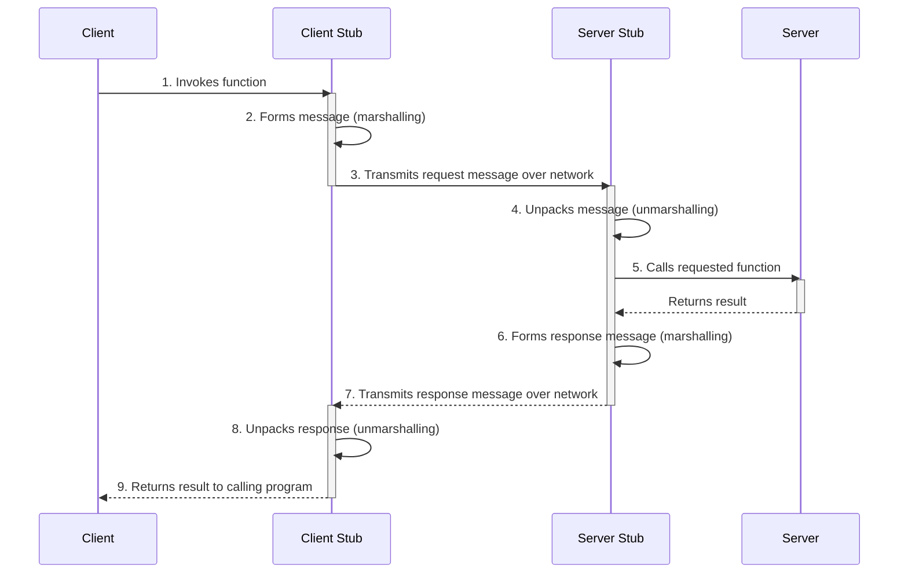
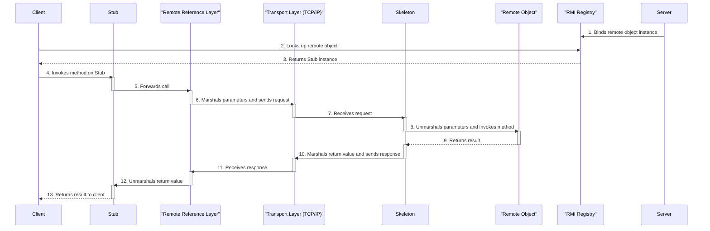
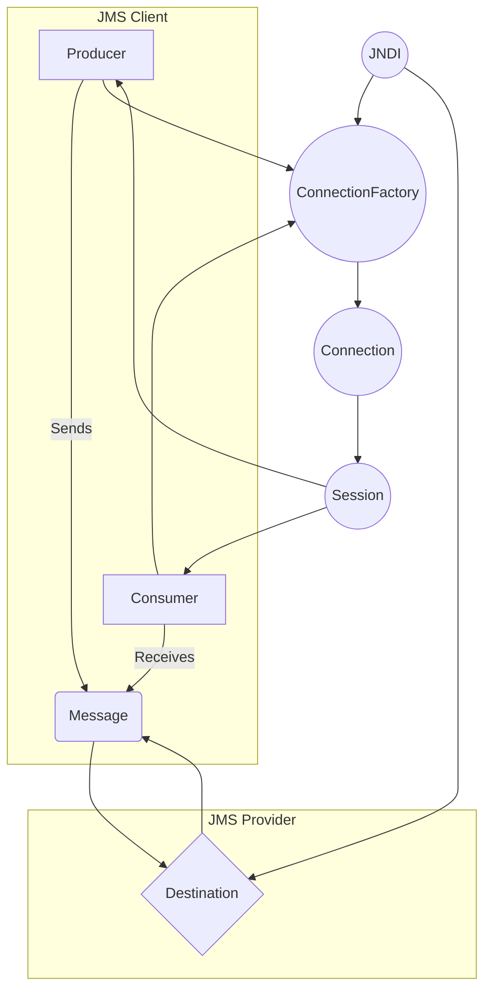

In the evolving landscape of distributed systems, where applications often span multiple devices, services, and networks, efficient communication between these components is essential. One foundational technology enabling seamless cross-platform and cross-network interactions is Remote Procedure Call (RPC). In this article, we’ll explore RPC, its underlying principles, benefits, use cases, and how it's implemented in modern systems.

## What is Remote Procedure Call (RPC)?
A Remote Procedure Call (RPC) is a protocol that allows a program to execute a procedure (or function) on a remote server as if it were a local call. Rather than dealing with the complexities of network programming, RPC abstracts the details, allowing developers to focus on their core application logic without worrying about the underlying communication infrastructure.

To understand RPC, imagine you’re calling a function on your local machine. With RPC, this same function call is sent over a network, executed on a different machine, and the result is sent back. This simple idea enables powerful interactions across distributed systems, making it easy to invoke services remotely.

## Key Components of RPC
RPC relies on three main components to perform remote calls effectively:

- **Client**: The initiating program that calls a function, requesting a service.
- **Server**: The program that receives the function call, executes the requested operation, and returns the result to the client.
- **Transport Mechanism**: Typically an underlying network protocol (like TCP or HTTP) that transmits the requests and responses between the client and server.

## RPC Workflow
Here's a simplified workflow of an RPC call:




The beauty of this workflow is its transparency to the developer, who can invoke remote services with a straightforward function call.

## Benefits of Using RPC
1. Simplified Communication
RPC abstracts the intricacies of network communication, allowing developers to treat remote functions like local ones. This simplification reduces the amount of boilerplate code required for networking.

2. High Efficiency
Unlike protocols like HTTP, which carry overhead, RPC is optimized for speed, often enabling faster and more efficient calls. Protocols such as gRPC, a popular modern RPC framework by Google, use binary data formats for efficient serialization.

3. Cross-Platform Support
RPC is versatile and can bridge different systems, allowing a Python client to call a Java server function or enabling an Android app to communicate with a cloud server.

4. Scalability in Microservices Architecture
In distributed systems and microservices, RPC allows different services to communicate seamlessly. This is particularly valuable when designing large, scalable systems, as it makes inter-service communication straightforward and reliable.

## Popular RPC Frameworks and Protocols
Today, various RPC frameworks and protocols are in use, each designed to cater to specific needs and optimizations:

1. gRPC
Developed by Google, gRPC is an open-source RPC framework that uses Protocol Buffers (protobuf) for data serialization, offering both performance and language-agnostic support. It is widely used in microservices architectures for its efficiency and support for bi-directional streaming.

2. Apache Thrift
Originally developed by Facebook, Apache Thrift provides a language-agnostic RPC framework and serialization mechanism. Thrift is known for its cross-language capabilities and is commonly used in environments requiring services written in different programming languages.

3. JSON-RPC and XML-RPC
JSON-RPC and XML-RPC are lightweight protocols that use JSON and XML formats, respectively, for data interchange. They are relatively simple to implement and are useful in scenarios where speed is not a critical requirement.

4. DCE/RPC
Used by Microsoft in Windows-based distributed applications, DCE/RPC is highly optimized for secure communication in enterprise environments, making it popular in enterprise systems.

## Common Use Cases of RPC
1. Microservices Communication
In microservices architecture, services need a way to communicate efficiently. RPC enables services to request and send data seamlessly, keeping response times low.

2. Client-Server Applications
For mobile apps or web applications that rely on a server for data or processing power, RPC can help execute backend logic, keeping client-side logic light and performance smooth.

3. Cloud Services and APIs
RPC is popular in cloud platforms where different components need to interact across distributed environments. Many cloud providers use RPC to implement APIs, allowing clients to access remote services effortlessly.

4. Real-time Systems
Real-time applications, like IoT and gaming, benefit from RPC due to its low-latency nature. Using protocols like gRPC allows devices to send and receive data with minimal delay, which is essential for time-sensitive applications.

## Challenges and Considerations with RPC
While RPC offers significant benefits, there are challenges to keep in mind:

1. Error Handling
Network failures, timeouts, and server crashes can disrupt RPC calls. Ensuring that clients can gracefully handle such errors is crucial.

2. Latency and Bandwidth
Although RPC is designed to be efficient, it still introduces latency. Careful consideration is needed to balance network load and response times, especially in high-performance applications.

3. Security
RPC calls can expose sensitive functions and data. Implementing security measures like authentication, authorization, and data encryption is essential to protect RPC-based communication.

4. Interoperability
While RPC frameworks like gRPC and Apache Thrift aim to be language-agnostic, compatibility issues may arise if protocols or data serialization methods differ between systems.

## Conclusion
Remote Procedure Call (RPC) is a foundational technology for distributed systems, offering developers a powerful, simplified way to connect different components seamlessly. From microservices and cloud-based systems to real-time applications, RPC supports diverse use cases, optimizing performance and efficiency in cross-network communications. By choosing the right RPC framework and addressing its challenges, developers can leverage RPC to create scalable, reliable, and performant distributed applications.

## User Authentication and Session Management

This section details the implementation of user authentication and session management in the `WebStore` application. The implementation uses JSP, Servlets, and JDBC to provide a secure login system.

### Database Setup

The application requires a `users` table in the `test` database. The table is created automatically if it doesn't exist using a `ServletContextListener`.

**`DatabaseSetupListener.java`**
```java
package com.example.background;

import java.sql.Connection;
import java.sql.DriverManager;
import java.sql.Statement;
import javax.servlet.ServletContextEvent;
import javax.servlet.ServletContextListener;
import javax.servlet.annotation.WebListener;

@WebListener
public class DatabaseSetupListener implements ServletContextListener {

    @Override
    public void contextInitialized(ServletContextEvent sce) {
        try {
            Class.forName("com.mysql.cj.jdbc.Driver");
            Connection conn = DriverManager.getConnection("jdbc:mysql://localhost:3306/test", "root", "");
            Statement stmt = conn.createStatement();
            String sql = "CREATE TABLE IF NOT EXISTS users (" +
                         "id INT AUTO_INCREMENT PRIMARY KEY, " +
                         "username VARCHAR(255) NOT NULL UNIQUE, " +
                         "password VARCHAR(255) NOT NULL, " +
                         "name VARCHAR(255), " +
                         "email VARCHAR(255), " +
                         "created_at TIMESTAMP DEFAULT CURRENT_TIMESTAMP, " +
                         "updated_at TIMESTAMP DEFAULT CURRENT_TIMESTAMP ON UPDATE CURRENT_TIMESTAMP)";
            stmt.executeUpdate(sql);
            conn.close();
        } catch (Exception e) {
            e.printStackTrace();
        }
    }

    @Override
    public void contextDestroyed(ServletContextEvent sce) {
        // No cleanup needed
    }
}
```

### Model

The `User.java` class is a simple JavaBean that represents a user.

**`User.java`**
```java
package com.example.model;

public class User {
    private int id;
    private String username;
    private String password;
    private String name;
    private String email;

    // Getters and setters
}
```

The `UserDAO.java` class handles all database operations related to users.

**`UserDAO.java`**
```java
package com.example.model;

import java.sql.Connection;
import java.sql.DriverManager;
import java.sql.PreparedStatement;
import java.sql.ResultSet;
import java.sql.SQLException;

public class UserDAO {

    private Connection getConnection() throws SQLException, ClassNotFoundException {
        Class.forName("com.mysql.cj.jdbc.Driver");
        return DriverManager.getConnection("jdbc:mysql://localhost:3306/test", "root", "");
    }

    public void registerUser(User user) {
        String sql = "INSERT INTO users (username, password, name, email) VALUES (?, ?, ?, ?)";
        try (Connection conn = getConnection();
             PreparedStatement stmt = conn.prepareStatement(sql)) {
            stmt.setString(1, user.getUsername());
            stmt.setString(2, user.getPassword());
            stmt.setString(3, user.getName());
            stmt.setString(4, user.getEmail());
            stmt.executeUpdate();
        } catch (Exception e) {
            e.printStackTrace();
        }
    }

    public User getUserByUsername(String username) {
        String sql = "SELECT * FROM users WHERE username = ?";
        User user = null;
        try (Connection conn = getConnection();
             PreparedStatement stmt = conn.prepareStatement(sql)) {
            stmt.setString(1, username);
            ResultSet rs = stmt.executeQuery();
            if (rs.next()) {
                user = new User();
                user.setId(rs.getInt("id"));
                user.setUsername(rs.getString("username"));
                user.setPassword(rs.getString("password"));
                user.setName(rs.getString("name"));
                user.setEmail(rs.getString("email"));
            }
        } catch (Exception e) {
            e.printStackTrace();
        }
        return user;
    }
}
```

### Servlets

*   **`RegisterServlet.java`**: Handles user registration.
*   **`LoginServlet.java`**: Handles user login and creates a session.
*   **`LogoutServlet.java`**: Invalidates the user session.

### JSP Pages

*   **`register.jsp`**: A form for new users to register.
*   **`login.jsp`**: A form for existing users to log in.
*   **`dashboard.jsp`**: A simple dashboard page that is only accessible to logged-in users.

## XML Resume Parsing

The application allows users to upload their resumes in XML format. The uploaded resumes are then parsed using Java's DOM parser and the extracted information is stored in the database.

### What is a DOM Parser?

The Document Object Model (DOM) parser is a type of XML parser that reads the entire XML document and creates a tree-like structure of it in memory. Each node in the tree represents a part of the XML document, such as an element, attribute, or text. The DOM parser provides a way to navigate and manipulate this tree structure, allowing you to access and modify the content of the XML document.

### Implementation

The `ResumeUploadServlet` handles the file upload and parsing. It uses the `javax.xml.parsers` package to parse the XML file.

**`ResumeUploadServlet.java`**
```java
package com.example.servlets;

import com.example.model.Resume;
import com.example.model.ResumeDAO;
import com.example.model.User;
import java.io.IOException;
import java.io.InputStream;
import javax.servlet.ServletException;
import javax.servlet.annotation.MultipartConfig;
import javax.servlet.annotation.WebServlet;
import javax.servlet.http.HttpServlet;
import javax.servlet.http.HttpServletRequest;
import javax.servlet.http.HttpServletResponse;
import javax.servlet.http.HttpSession;
import javax.servlet.http.Part;
import javax.xml.parsers.DocumentBuilder;
import javax.xml.parsers.DocumentBuilderFactory;
import org.w3c.dom.Document;
import org.w3c.dom.Element;
import org.w3c.dom.Node;
import org.w3c.dom.NodeList;

@WebServlet("/upload-resume")
@MultipartConfig
public class ResumeUploadServlet extends HttpServlet {
    private static final long serialVersionUID = 1L;

    protected void doPost(HttpServletRequest request, HttpServletResponse response) throws ServletException, IOException {
        HttpSession session = request.getSession(false);
        if (session == null || session.getAttribute("user") == null) {
            response.sendRedirect("login.jsp");
            return;
        }

        User user = (User) session.getAttribute("user");
        Part filePart = request.getPart("resume");

        try (InputStream fileContent = filePart.getInputStream()) {
            DocumentBuilderFactory dbFactory = DocumentBuilderFactory.newInstance();
            DocumentBuilder dBuilder = dbFactory.newDocumentBuilder();
            Document doc = dBuilder.parse(fileContent);
            doc.getDocumentElement().normalize();

            StringBuilder resumeText = new StringBuilder();
            NodeList nList = doc.getElementsByTagName("resume");

            for (int temp = 0; temp < nList.getLength(); temp++) {
                Node nNode = nList.item(temp);
                if (nNode.getNodeType() == Node.ELEMENT_NODE) {
                    Element eElement = (Element) nNode;
                    resumeText.append("Name: ").append(eElement.getElementsByTagName("name").item(0).getTextContent()).append("\n");
                    resumeText.append("Email: ".concat(eElement.getElementsByTagName("email").item(0).getTextContent())).append("\n");
                    resumeText.append("Phone: ").append(eElement.getElementsByTagName("phone").item(0).getTextContent()).append("\n");
                }
            }

            Resume resume = new Resume();
            resume.setUserId(user.getId());
            resume.setResumeText(resumeText.toString());

            ResumeDAO resumeDAO = new ResumeDAO();
            resumeDAO.saveResume(resume);

            response.sendRedirect("dashboard.jsp?upload=success");

        } catch (Exception e) {
            e.printStackTrace();
            response.sendRedirect("resume.jsp?error=1");
        }
    }
}


```

### `ResumeUploadServlet.java` Line-by-Line Explanation

This servlet is responsible for handling the upload of XML resume files, parsing them, and storing the extracted data into the database.

```java
// Declares the package where the servlet resides.
package com.example.servlets;

// Imports necessary classes for the servlet's functionality.
import com.example.model.Resume;
import com.example.model.ResumeDAO;
import com.example.model.User;
import java.io.IOException;
import java.io.InputStream;
import javax.servlet.ServletException;
import javax.servlet.annotation.MultipartConfig;
import javax.servlet.annotation.WebServlet;
import javax.servlet.http.HttpServlet;
import javax.servlet.http.HttpServletRequest;
import javax.servlet.http.HttpServletResponse;
import javax.servlet.http.HttpSession;
import javax.servlet.http.Part;
import javax.xml.parsers.DocumentBuilder;
import javax.xml.parsers.DocumentBuilderFactory;
import org.w3c.dom.Document;
import org.w3c.dom.Element;
import org.w3c.dom.Node;
import org.w3c.dom.NodeList;

// Annotations to configure the servlet.
@WebServlet("/upload-resume") // Maps the servlet to the URL "/upload-resume".
@MultipartConfig // Indicates that the servlet will handle multipart/form-data requests (file uploads).
public class ResumeUploadServlet extends HttpServlet {
    private static final long serialVersionUID = 1L; // Unique identifier for the servlet class.

    // This method is called when a POST request is sent to the servlet.
    protected void doPost(HttpServletRequest request, HttpServletResponse response) throws ServletException, IOException {
        // Get the current session, but don't create a new one if it doesn't exist.
        HttpSession session = request.getSession(false);

        // Check if the user is logged in. If not, redirect to the login page.
        if (session == null || session.getAttribute("user") == null) {
            response.sendRedirect("login.jsp");
            return; // Stop further execution.
        }

        // Get the logged-in user object from the session.
        User user = (User) session.getAttribute("user");
        // Get the uploaded file from the request.
        Part filePart = request.getPart("resume");

        // Use a try-with-resources statement to automatically close the input stream.
        try (InputStream fileContent = filePart.getInputStream()) {
            // Create a new DocumentBuilderFactory to create a DocumentBuilder.
            DocumentBuilderFactory dbFactory = DocumentBuilderFactory.newInstance();
            // Create a new DocumentBuilder to parse the XML file.
            DocumentBuilder dBuilder = dbFactory.newDocumentBuilder();
            // Parse the XML file and create a Document object.
            Document doc = dBuilder.parse(fileContent);
            // Normalize the XML structure.
            doc.getDocumentElement().normalize();

            // Create a StringBuilder to store the parsed resume text.
            StringBuilder resumeText = new StringBuilder();
            // Get a list of all elements with the tag name "resume".
            NodeList nList = doc.getElementsByTagName("resume");

            // Iterate through the "resume" elements.
            for (int temp = 0; temp < nList.getLength(); temp++) {
                // Get the current node.
                Node nNode = nList.item(temp);
                // Check if the node is an element.
                if (nNode.getNodeType() == Node.ELEMENT_NODE) {
                    // Cast the node to an Element.
                    Element eElement = (Element) nNode;
                    // Get the text content of the "name", "email", and "phone" elements and append them to the resumeText StringBuilder.
                    resumeText.append("Name: ").append(eElement.getElementsByTagName("name").item(0).getTextContent()).append("\n");
                    resumeText.append("Email: ".concat(eElement.getElementsByTagName("email").item(0).getTextContent())).append("\n");
                    resumeText.append("Phone: ").append(eElement.getElementsByTagName("phone").item(0).getTextContent()).append("\n");
                }
            }

            // Create a new Resume object.
            Resume resume = new Resume();
            // Set the user ID for the resume.
            resume.setUserId(user.getId());
            // Set the parsed resume text.
            resume.setResumeText(resumeText.toString());

            // Create a new ResumeDAO object.
            ResumeDAO resumeDAO = new ResumeDAO();
            // Save the resume to the database.
            resumeDAO.saveResume(resume);

            // Redirect to the dashboard with a success message.
            response.sendRedirect("dashboard.jsp?upload=success");

        } catch (Exception e) {
            // Print the stack trace for debugging purposes.
            e.printStackTrace();
            // Redirect to the resume upload page with an error message.
            response.sendRedirect("resume.jsp?error=1");
        }
    }
}
```

## Java Remote Method Invocation (RMI)


### What is RMI?
Java Remote Method Invocation (RMI) is a Java-specific API that enables an object running in one Java Virtual Machine (JVM) to invoke methods on an object running in another JVM. RMI provides the mechanism by which the server and client communicate and pass information back and forth. It is a higher-level API built on top of sockets that allows developers to create distributed Java applications with relative ease.

### RMI Architecture
The RMI architecture is based on a layered approach, with each layer providing a specific service and abstracting the details of the layer below it.



### Components of the RMI Architecture

The RMI architecture consists of the following key components:

-   **Remote Interface:** A Java interface that extends the `java.rmi.Remote` interface. It declares the methods that can be called remotely by a client.
-   **Remote Object:** The implementation of the remote interface. This object resides on the server and its methods are executed when a client invokes them. It typically extends `java.rmi.server.UnicastRemoteObject`.
-   **Stub (Client-side Proxy):** A client-side object that acts as a proxy for the remote object. It implements the same remote interface as the server's remote object. When a client invokes a method on the stub, the stub is responsible for marshalling the arguments and sending the request to the server.
-   **Skeleton (Server-side Proxy):** A server-side object that receives the request from the client's stub. It unmarshals the arguments, invokes the actual method on the remote object, and then marshals the result to send back to the client. (Note: In modern versions of Java, skeletons are no longer necessary and are handled dynamically by the RMI runtime).
-   **Remote Reference Layer (RRL):** This layer manages the references to remote objects. It is responsible for creating and managing the communication links between the client and the server.
-   **Transport Layer:** This is the underlying network layer that handles the actual transmission of data between the client and server. It uses standard networking protocols like TCP/IP.

### The RMI Registry
The RMI Registry is a simple, server-side name service that allows clients to obtain a reference (a stub) to a remote object. Before a client can invoke a method on a remote object, it must first locate that object.

Here's how it works:
1.  **Server-side:** A server application creates an instance of a remote object and registers it with the RMI Registry using a unique, human-readable name (a string).
2.  **Client-side:** The client application, knowing the name and location (host and port) of the RMI Registry, performs a "lookup" to find the remote object.
3.  **Registry Response:** The RMI Registry, upon receiving the lookup request, returns the corresponding stub object to the client.
4.  **Client Communication:** The client can now use this stub to invoke methods on the remote object as if it were a local object.

The RMI Registry acts as a central directory for remote objects, decoupling the client from the server's specific object creation process.

### RMI Application Example: Step-by-Step

Let's walk through the creation of a simple "Hello, World!" RMI application.

#### Step 1: Define the Remote Interface

First, we define a Java interface that extends `java.rmi.Remote`. This interface will declare the methods that a client can invoke on the remote server. Each method must throw `java.rmi.RemoteException`.

**`Hello.java`**
```java
import java.rmi.Remote;
import java.rmi.RemoteException;

public interface Hello extends Remote {
    String sayHello() throws RemoteException;
}
```

#### Step 2: Implement the Remote Object

Next, we create a class that implements the remote interface. This class contains the actual logic of the methods declared in the interface. It should extend `java.rmi.server.UnicastRemoteObject` to handle the RMI communication.

**`HelloImpl.java`**
```java
import java.rmi.server.UnicastRemoteObject;
import java.rmi.RemoteException;

public class HelloImpl extends UnicastRemoteObject implements Hello {

    public HelloImpl() throws RemoteException {
        super();
    }

    public String sayHello() throws RemoteException {
        return "Hello, world!";
    }
}
```

#### Step 3: Create the RMI Server

The server is responsible for creating an instance of the remote object and binding it to the RMI Registry with a unique name.

**`Server.java`**
```java
import java.rmi.registry.LocateRegistry;
import java.rmi.registry.Registry;

public class Server {
    public static void main(String[] args) {
        try {
            HelloImpl obj = new HelloImpl();
            Registry registry = LocateRegistry.createRegistry(1099); // Default RMI port
            registry.bind("Hello", obj);
            System.err.println("Server ready");
        } catch (Exception e) {
            System.err.println("Server exception: " + e.toString());
            e.printStackTrace();
        }
    }
}
```

#### Step 4: Create the RMI Client

The client looks up the remote object in the RMI Registry, obtains the stub, and then invokes the remote methods.

**`Client.java`**
```java
import java.rmi.registry.LocateRegistry;
import java.rmi.registry.Registry;

public class Client {
    private Client() {}

    public static void main(String[] args) {
        String host = (args.length < 1) ? null : args[0];
        try {
            Registry registry = LocateRegistry.getRegistry(host);
            Hello stub = (Hello) registry.lookup("Hello");
            String response = stub.sayHello();
            System.out.println("response: " + response);
        } catch (Exception e) {
            System.err.println("Client exception: " + e.toString());
            e.printStackTrace();
        }
    }
}
```

#### Step 5: Compile and Run the Application

1.  **Compile the Java files:**
    ```bash
    javac *.java
    ```

2.  **Start the RMI Registry:**
    Open a new terminal and run:
    ```bash
    rmiregistry
    ```

3.  **Run the Server:**
    Open another terminal and run:
    ```bash
    java Server
    ```

4.  **Run the Client:**
    Open a third terminal and run:
    ```bash
    java Client
    ```

If everything is set up correctly, the client will print: `response: Hello, world!`

## RMI vs. RPC: A Comparison

| Feature               | RPC (Remote Procedure Call)                                  | RMI (Remote Method Invocation)                                     |
| --------------------- | ------------------------------------------------------------ | ------------------------------------------------------------------ |
| **Paradigm**          | Procedure-based. Focuses on calling functions or procedures. | Object-oriented. Focuses on invoking methods on remote objects.    |
| **Language Support**  | Language-agnostic. Can be used between different languages.  | Java-specific. Designed for Java-to-Java communication.            |
| **Data Transfer**     | Typically transfers simple data types (integers, strings, etc.). | Can transfer complex Java objects (that are `Serializable`).       |
| **Complexity**        | Generally simpler and more lightweight.                      | More complex due to its object-oriented nature and features.       |
| **Use Case**          | Ideal for heterogeneous environments and microservices.      | Best suited for homogeneous systems where all components use Java. |
| **Underlying Protocol** | Can use various protocols (e.g., TCP, HTTP, custom).         | Uses the Java Remote Method Protocol (JRMP).                       |

## CORBA (Common Object Request Broker Architecture)

### What is CORBA?
CORBA is a standard developed by the Object Management Group (OMG) to facilitate communication between distributed objects, regardless of the programming language they are written in or the operating system they run on. It enables applications to communicate with one another in a heterogeneous computing environment.

### CORBA Architecture
The core of the CORBA architecture is the Object Request Broker (ORB), which acts as a middleware that handles the communication between the client and the server.

Key components include:

-   **IDL (Interface Definition Language):** A language-neutral way to define the interfaces of remote objects. The IDL is used to generate the client-side stubs and server-side skeletons for different programming languages.
-   **ORB (Object Request Broker):** The middleware that allows clients to invoke methods on remote objects. The ORB is responsible for finding the remote object, marshalling and unmarshalling data, and handling the network communication.
-   **POA (Portable Object Adapter):** The server-side component that connects the remote object implementation to the ORB. It is responsible for managing the lifecycle of remote objects.
-   **Naming Service:** A service that allows clients to find remote objects by name, similar to the RMI Registry.

### CORBA Application Example: Step-by-Step

Here's a simplified example of a "Hello, World!" application using CORBA with Java.

#### Step 1: Define the Interface in IDL

First, we define the remote interface in an IDL file.

**`Hello.idl`**
```idl
module HelloApp {
    interface Hello {
        string sayHello();
    };
};
```

#### Step 2: Generate the Java Stubs and Skeletons

Next, we use the `idlj` compiler (which comes with the JDK) to generate the necessary Java files from the IDL file.

```bash
idlj -fall Hello.idl
```

This will generate a `HelloApp` directory containing several Java files, including:
-   `Hello.java` (the interface)
-   `HelloPOA.java` (the skeleton)
-   `_HelloStub.java` (the stub)
-   `HelloHelper.java` (helper class)
-   `HelloHolder.java` (holder class)

#### Step 3: Implement the Server-side Object

Now, we create a Java class that implements the generated `HelloPOA` skeleton.

**`HelloImpl.java`**
```java
import HelloApp.HelloPOA;

class HelloImpl extends HelloPOA {
    @Override
    public String sayHello() {
        return "\nHello world !!\n";
    }
}
```

#### Step 4: Create the CORBA Server

The server creates an instance of the `HelloImpl` object, initializes the ORB, and registers the object with the Naming Service.

**`Server.java`**
```java
import HelloApp.Hello;
import HelloApp.HelloHelper;
import org.omg.CORBA.ORB;
import org.omg.CosNaming.NameComponent;
import org.omg.CosNaming.NamingContextExt;
import org.omg.CosNaming.NamingContextExtHelper;
import org.omg.PortableServer.POA;
import org.omg.PortableServer.POAHelper;

public class Server {

    public static void main(String args[]) {
        try {
            // create and initialize the ORB
            ORB orb = ORB.init(args, null);

            // get reference to rootpoa & activate the POAManager
            POA rootpoa = POAHelper.narrow(orb.resolve_initial_references("RootPOA"));
            rootpoa.the_POAManager().activate();

            // create servant and register it with the ORB
            HelloImpl helloImpl = new HelloImpl();

            // get object reference from the servant
            org.omg.CORBA.Object ref = rootpoa.servant_to_reference(helloImpl);
            Hello href = HelloHelper.narrow(ref);

            // get the root naming context
            org.omg.CORBA.Object objRef =
                orb.resolve_initial_references("NameService");
            // Use NamingContextExt which is part of the Interoperable
            // Naming Service (INS) specification.
            NamingContextExt ncRef = NamingContextExtHelper.narrow(objRef);

            // bind the Object Reference in Naming
            String name = "Hello";
            NameComponent path[] = ncRef.to_name(name);
            ncRef.rebind(path, href);

            System.out.println("HelloServer ready and waiting ...");

            // wait for invocations from clients
            orb.run();
        } catch (Exception e) {
            System.err.println("ERROR: " + e);
            e.printStackTrace(System.out);
        }

        System.out.println("HelloServer Exiting ...");
    }
}
```

#### Step 5: Create the CORBA Client

The client initializes the ORB, looks up the remote object in the Naming Service, and then invokes its methods.

**`Client.java`**
```java
import HelloApp.Hello;
import HelloApp.HelloHelper;
import org.omg.CORBA.ORB;
import org.omg.CosNaming.NamingContextExt;
import org.omg.CosNaming.NamingContextExtHelper;

public class Client {
    static Hello helloImpl;

    public static void main(String args[]) {
        try {
            // create and initialize the ORB
            ORB orb = ORB.init(args, null);

            // get the root naming context
            org.omg.CORBA.Object objRef =
                orb.resolve_initial_references("NameService");
            // Use NamingContextExt instead of NamingContext. This is
            // part of the Interoperable Naming Service.
            NamingContextExt ncRef = NamingContextExtHelper.narrow(objRef);

            // resolve the Object Reference in Naming
            String name = "Hello";
            helloImpl = HelloHelper.narrow(ncRef.resolve_str(name));

            System.out.println("Obtained a handle on server object: " + helloImpl);
            System.out.println(helloImpl.sayHello());

        } catch (Exception e) {
            System.out.println("ERROR : " + e);
            e.printStackTrace(System.out);
        }
    }
}
```

#### Step 6: Compile and Run the Application

1.  **Compile the Java files:**
    ```bash
    javac *.java HelloApp/*.java
    ```

2.  **Start the Naming Service:**
    Open a new terminal and run:
    ```bash
    orbd -ORBInitialPort 1050
    ```

3.  **Run the Server:**
    Open another terminal and run:
    ```bash
    java Server -ORBInitialPort 1050
    ```

4.  **Run the Client:**
    Open a third terminal and run:
    ```bash
    java Client -ORBInitialPort 1050
    ```

If everything is set up correctly, the client will print: `Hello world !!`

## RMI vs. CORBA: A Comparison

| Feature               | RMI (Remote Method Invocation)                               | CORBA (Common Object Request Broker Architecture)              |
| --------------------- | ------------------------------------------------------------ | -------------------------------------------------------------- |
| **Language Support**  | Java-specific.                                               | Language-agnostic (supports Java, C++, Python, etc.).          |
| **Protocol**          | Uses Java Remote Method Protocol (JRMP).                     | Uses General Inter-ORB Protocol (GIOP) and IIOP for the internet. |
| **Complexity**        | Relatively simple to learn and use for Java developers.      | More complex due to its language-neutral nature and IDL.       |
| **Data Transfer**     | Can transfer serialized Java objects.                        | Transfers data types defined in the IDL.                       |
| **Use Case**          | Best for applications where all components are written in Java. | Ideal for enterprise-level, heterogeneous environments.        |

## Periodic Report Generation with Timer and TimerTask

In the `WebStore` application, we've implemented a feature that simulates the periodic generation of reports in the background. This is achieved using Java's `Timer` and `TimerTask` classes, which are fundamental for scheduling tasks in a Java application.

### Understanding `Timer` and `TimerTask`

*   **`java.util.Timer`**: A facility for threads to schedule tasks for future execution in a background thread. Tasks may be scheduled for one-time execution, or for repeated execution at regular intervals.
*   **`java.util.TimerTask`**: An abstract class that represents a task that can be scheduled by a `Timer`. To create a task, you need to extend this class and implement the `run()` method, which contains the code to be executed.

### Implementation Details

The implementation consists of three main parts:

1.  **`ReportGeneratorTask.java`**: This class extends `TimerTask` and contains the logic for generating a report. In the `run()` method, it retrieves a list of reports from the `ServletContext`, adds a new report with the current timestamp, and then updates the list in the `ServletContext`.

    ```java
    package com.example.background;

    import java.util.ArrayList;
    import java.util.Date;
    import java.util.List;
    import java.util.TimerTask;
    import javax.servlet.ServletContext;

    public class ReportGeneratorTask extends TimerTask {

        private final ServletContext context;

        public ReportGeneratorTask(ServletContext context) {
            this.context = context;
        }

        @Override
        public void run() {
            List<String> reports = (List<String>) context.getAttribute("reports");
            if (reports == null) {
                reports = new ArrayList<>();
                context.setAttribute("reports", reports);
            }
            String report = "Report generated at " + new Date();
            reports.add(report);
            System.out.println(report);
        }
    }
    ```

2.  **`ReportSchedulerListener.java`**: This class implements `ServletContextListener`, which allows it to be notified when the web application is started or shut down.
    *   In the `contextInitialized()` method (when the application starts), it creates a `Timer` and schedules the `ReportGeneratorTask` to run every 10 seconds (10,000 milliseconds).
    *   In the `contextDestroyed()` method (when the application stops), it cancels the `Timer` to prevent memory leaks and stop the background process.

    ```java
    package com.example.background;

    import java.util.Timer;
    import javax.servlet.ServletContextEvent;
    import javax.servlet.ServletContextListener;
    import javax.servlet.annotation.WebListener;

    @WebListener
    public class ReportSchedulerListener implements ServletContextListener {

        private Timer timer;

        @Override
        public void contextInitialized(ServletContextEvent sce) {
            timer = new Timer();
            timer.schedule(new ReportGeneratorTask(sce.getServletContext()), 0, 10000); // Run every 10 seconds
        }

        @Override
        public void contextDestroyed(ServletContextEvent sce) {
            if (timer != null) {
                timer.cancel();
            }
        }
    }
    ```

3.  **`reports.jsp`**: This JSP file is responsible for displaying the generated reports to the user. It uses JSTL's `c:forEach` loop to iterate over the list of reports stored in the `applicationScope` (the `ServletContext`) and displays each report in a list item. The page also includes a meta refresh tag to automatically reload the page every 10 seconds, ensuring that the latest reports are displayed.

    ```jsp
    <%@ page contentType="text/html;charset=UTF-8" language="java" %>
    <%@ taglib uri="http://java.sun.com/jsp/jstl/core" prefix="c" %>
    <html>
    <head>
        <title>Periodic Reports</title>
        <meta http-equiv="refresh" content="10">
    </head>
    <body>
        <h1>Periodic Reports</h1>
        <ul>
            <c:forEach var="report" items="${applicationScope.reports}">
                <li><c:out value="${report}"/></li>
            </c:forEach>
        </ul>
    </body>
    </html>
    ```

This implementation provides a simple yet effective way to perform background tasks in a web application, with the results being made available to the frontend for display.

## Java Message Service (JMS)

### What is JMS?

The Java Message Service (JMS) is a Java API that allows applications to create, send, receive, and read messages. It provides a common way for Java applications to communicate with other messaging implementations. JMS is a part of the Java Platform, Enterprise Edition (Java EE) and is defined by a set of interfaces and associated semantics.

### JMS Architecture

The JMS architecture consists of the following components:

*   **JMS Provider**: A messaging system that implements the JMS interfaces and provides administrative and control features.
*   **JMS Client**: An application or component that produces and/or consumes messages.
    *   **Producer/Publisher**: A JMS client that creates and sends messages.
    *   **Consumer/Subscriber**: A JMS client that receives messages.
*   **Administered Objects**: Preconfigured JMS objects created by an administrator for the use of clients.
    *   **ConnectionFactory**: The object a client uses to create a connection to a provider.
    *   **Destination**: The object a client uses to specify the destination of messages it is sending and the source of messages it is receiving.
*   **JNDI (Java Naming and Directory Interface)**: A Java API for a directory service that allows Java programs to discover and look up data and objects via a name. JMS administered objects are typically stored in a JNDI namespace.

Here is a diagram illustrating the JMS architecture:



**Explanation of the diagram:**

1.  The **JMS Client** (Producer and Consumer) looks up the **ConnectionFactory** and **Destination** objects from the **JNDI** service.
2.  The client uses the **ConnectionFactory** to create a **Connection** to the **JMS Provider**.
3.  The **Connection** is used to create a **Session**.
4.  The **Producer** uses the **Session** to create a **MessageProducer** to send messages to the **Destination**.
5.  The **Consumer** uses the **Session** to create a **MessageConsumer** to receive messages from the **Destination**.

### JMS Provider

A JMS provider is a messaging system that implements the JMS specification. It is responsible for routing and delivering messages. Some popular JMS providers include:

*   Apache ActiveMQ
*   RabbitMQ
*   IBM MQ
*   Oracle WebLogic JMS

### JMS Client

A JMS client is a Java application that uses the JMS API to send and receive messages.

*   **Producer (or Publisher)**: A client that creates and sends messages to a destination.
*   **Consumer (or Subscriber)**: A client that receives messages from a destination.

### Administered Tool

An administered tool is a tool provided by a JMS provider to manage and configure the messaging system. It is used to create and manage administered objects such as connection factories and destinations.

### JNDI (Java Naming and Directory Interface)

JNDI is a Java API that provides a unified interface to various naming and directory services. In the context of JMS, JNDI is used to store and retrieve administered objects. This allows JMS clients to be decoupled from the specific configuration of the JMS provider.

## JMS Producer and Consumer Implementation

This section provides a practical example of a JMS message producer and a message-driven bean (MDB) consumer within the `WhisperStream` application.

### JMS Producer: `MessageProducerServlet.java`

This servlet acts as a message producer. It receives a message from an HTTP GET request and sends it to a JMS queue.

```java
package com.example;

import jakarta.annotation.Resource;
import jakarta.jms.ConnectionFactory;
import jakarta.jms.JMSContext;
import jakarta.jms.JMSProducer;
import jakarta.jms.Queue;
import jakarta.servlet.ServletException;
import jakarta.servlet.annotation.WebServlet;
import jakarta.servlet.http.HttpServlet;
import jakarta.servlet.http.HttpServletRequest;
import jakarta.servlet.http.HttpServletResponse;
import java.io.IOException;

@WebServlet("/produce")
public class MessageProducerServlet extends HttpServlet {

    @Resource(lookup = "java:comp/DefaultJMSConnectionFactory")
    private ConnectionFactory connectionFactory;

    @Resource(lookup = "jms/myQueue")
    private Queue queue;

    @Override
    protected void doGet(HttpServletRequest request, HttpServletResponse response)
            throws ServletException, IOException {
        String messageText = request.getParameter("message");
        if (messageText == null) {
            messageText = "Hello, World!";
        }

        try (JMSContext context = connectionFactory.createContext()) {
            JMSProducer producer = context.createProducer();
            producer.send(queue, messageText);
        }

        response.getWriter().println("Message sent: " + messageText);
    }
}
```

#### Line-by-Line Explanation

*   `package com.example;`: Declares the package for the class.
*   `import ...;`: Imports the necessary JMS, Servlet, and I/O classes.
*   `@WebServlet("/produce")`: Annotates the class as a servlet and maps it to the URL `/produce`.
*   `public class MessageProducerServlet extends HttpServlet {`: Defines the servlet class.
*   `@Resource(lookup = "java:comp/DefaultJMSConnectionFactory")`: Injects the default JMS ConnectionFactory resource provided by the application server. The lookup name is a standard JNDI name.
*   `private ConnectionFactory connectionFactory;`: Declares the variable to hold the injected `ConnectionFactory`.
*   `@Resource(lookup = "jms/myQueue")`: Injects the JMS Queue destination. The lookup name `jms/myQueue` is a JNDI name configured in the application server (e.g., in `glassfish-resources.xml`).
*   `private Queue queue;`: Declares the variable to hold the injected `Queue`.
*   `protected void doGet(...)`: Handles HTTP GET requests.
*   `String messageText = request.getParameter("message");`: Retrieves the `message` parameter from the request URL.
*   `if (messageText == null) { ... }`: If the `message` parameter is not provided, it defaults to "Hello, World!".
*   `try (JMSContext context = connectionFactory.createContext()) { ... }`: Creates a `JMSContext` from the `ConnectionFactory`. The try-with-resources statement ensures the context is automatically closed. `JMSContext` combines a connection and a session.
*   `JMSProducer producer = context.createProducer();`: Creates a `JMSProducer` from the context.
*   `producer.send(queue, messageText);`: Sends the message to the specified `queue`.
*   `response.getWriter().println("Message sent: " + messageText);`: Writes a confirmation message to the HTTP response.

### JMS Consumer: `MyMDB.java`

This is a Message-Driven Bean (MDB) that acts as a message consumer. It listens for messages on the `jms/myQueue` and processes them as they arrive.

```java
package com.example;

import jakarta.ejb.ActivationConfigProperty;
import jakarta.ejb.MessageDriven;
import jakarta.jms.JMSException;
import jakarta.jms.Message;
import jakarta.jms.MessageListener;
import jakarta.jms.TextMessage;

@MessageDriven(
    activationConfig = {
        @ActivationConfigProperty(propertyName = "destinationLookup", propertyValue = "jms/myQueue"),
        @ActivationConfigProperty(propertyName = "destinationType", propertyValue = "jakarta.jms.Queue")
    }
)
public class MyMDB implements MessageListener {

    @Override
    public void onMessage(Message message) {
        try {
            if (message instanceof TextMessage) {
                TextMessage textMessage = (TextMessage) message;
                System.out.println("MDB Received Message: " + textMessage.getText());
            } else {
                System.out.println("MDB Received non-text message.");
            }
        } catch (JMSException e) {
            e.printStackTrace();
        }
    }
}
```

#### Line-by-Line Explanation

*   `package com.example;`: Declares the package for the class.
*   `import ...;`: Imports the necessary EJB and JMS classes.
*   `@MessageDriven(...)`: Annotates the class as a Message-Driven Bean.
*   `activationConfig = { ... }`: Specifies the configuration for the MDB.
*   `@ActivationConfigProperty(propertyName = "destinationLookup", propertyValue = "jms/myQueue")`: Tells the EJB container that this MDB should listen on the JMS destination with the JNDI name `jms/myQueue`.
*   `@ActivationConfigProperty(propertyName = "destinationType", propertyValue = "jakarta.jms.Queue")`: Specifies that the destination type is a `jakarta.jms.Queue`.
*   `public class MyMDB implements MessageListener {`: Defines the MDB class, which must implement the `MessageListener` interface.
*   `@Override public void onMessage(Message message) {`: This is the callback method that the EJB container invokes when a message arrives at the destination.
*   `try { ... } catch (JMSException e) { ... }`: A try-catch block to handle potential `JMSException`.
*   `if (message instanceof TextMessage) { ... }`: Checks if the received message is a `TextMessage`.
*   `TextMessage textMessage = (TextMessage) message;`: Casts the `Message` to a `TextMessage`.
*   `System.out.println("MDB Received Message: " + textMessage.getText());`: Retrieves the text from the message and prints it to the console.
*   `else { ... }`: Handles cases where the message is not a `TextMessage`.

## Message-Driven Beans (MDB)

### What is a Message-Driven Bean?

A Message-Driven Bean (MDB) is a type of Enterprise JavaBean (EJB) that provides an event-based, asynchronous way to process messages. MDBs are designed to act as message listeners in the Java EE ecosystem, integrating with messaging systems like the Java Message Service (JMS).

Unlike Session Beans, which are invoked synchronously through method calls, MDBs are triggered by the arrival of a message at a specific destination (a queue or a topic). The EJB container manages the lifecycle of the MDB instances, automatically creating a pool of beans to process incoming messages concurrently. This makes MDBs a powerful and scalable solution for building loosely coupled, message-driven architectures.

### How MDBs work with JMS

When used with JMS, an MDB is configured to listen on a specific JMS destination. Here's the typical workflow:

1.  **Configuration:** The MDB is annotated with `@MessageDriven` and its `activationConfig` is set to point to a JMS destination (e.g., `jms/myQueue`) and specify the destination type (e.g., `jakarta.jms.Queue`).
2.  **Deployment:** When the application is deployed, the EJB container reads these annotations.
3.  **Listening:** The container establishes a connection to the JMS provider and starts listening for messages on the configured destination.
4.  **Message Arrival:** When a message arrives at the destination, the JMS provider delivers it to the EJB container.
5.  **Invocation:** The container picks an MDB instance from its pool and invokes its `onMessage()` method, passing the incoming message as an argument.
6.  **Processing:** The business logic inside the `onMessage()` method is executed to process the message.

This entire process is managed by the container, freeing the developer from the complexities of connection management, session handling, and concurrent message consumption.

### Implementation Example: `MyMDB.java`

The `MyMDB.java` class from the `WhisperStream` project is a perfect example of a JMS-based Message-Driven Bean.

```java
package com.example;

import jakarta.ejb.ActivationConfigProperty;
import jakarta.ejb.MessageDriven;
import jakarta.jms.JMSException;
import jakarta.jms.Message;
import jakarta.jms.MessageListener;
import jakarta.jms.TextMessage;

@MessageDriven(
    activationConfig = {
        @ActivationConfigProperty(propertyName = "destinationLookup", propertyValue = "jms/myQueue"),
        @ActivationConfigProperty(propertyName = "destinationType", propertyValue = "jakarta.jms.Queue")
    }
)
public class MyMDB implements MessageListener {

    @Override
    public void onMessage(Message message) {
        try {
            if (message instanceof TextMessage) {
                TextMessage textMessage = (TextMessage) message;
                System.out.println("MDB Received Message: " + textMessage.getText());
            } else {
                System.out.println("MDB Received non-text message.");
            }
        } catch (JMSException e) {
            e.printStackTrace();
        }
    }
}
```

### Line-by-Line Explanation

*   `package com.example;`: Declares the package where the MDB class resides.
*   `import ...;`: Imports the necessary classes from the `jakarta.ejb` and `jakarta.jms` APIs.
*   `@MessageDriven(...)`: This annotation marks the class as a Message-Driven Bean. The EJB container will recognize it and manage its lifecycle.
*   `activationConfig = { ... }`: This array contains the activation configuration properties that tell the container how to connect the MDB to the messaging system.
*   `@ActivationConfigProperty(propertyName = "destinationLookup", propertyValue = "jms/myQueue")`: This property specifies the JNDI name of the JMS destination that this MDB will listen to. In this case, it's the queue named `jms/myQueue`.
*   `@ActivationConfigProperty(propertyName = "destinationType", propertyValue = "jakarta.jms.Queue")`: This property defines the type of the destination. Here, it's specified as a JMS Queue. It could also be a `jakarta.jms.Topic`.
*   `public class MyMDB implements MessageListener {`: This is the MDB class definition. It must implement the `jakarta.jms.MessageListener` interface. This interface contains a single method, `onMessage`.
*   `@Override public void onMessage(Message message) {`: This is the core method of the MDB. The EJB container calls this method whenever a new message arrives at the `jms/myQueue`. The `Message` object itself is passed as the argument.
*   `try { ... } catch (JMSException e) { ... }`: This block handles potential exceptions that can occur while processing the JMS message.
*   `if (message instanceof TextMessage) { ... }`: This line checks if the received message is of the type `TextMessage`. JMS supports various message types (ObjectMessage, BytesMessage, etc.), so it's good practice to check the type before processing.
*   `TextMessage textMessage = (TextMessage) message;`: If the message is a `TextMessage`, it is cast to the appropriate type.
*   `System.out.println("MDB Received Message: " + textMessage.getText());`: The content of the text message is extracted using the `getText()` method and printed to the standard output. This is where the main business logic for processing the message would go.
*   `else { ... }`: If the message is not a `TextMessage`, a different message is printed.
*   `e.printStackTrace();`: If a `JMSException` occurs, its stack trace is printed for debugging purposes.

